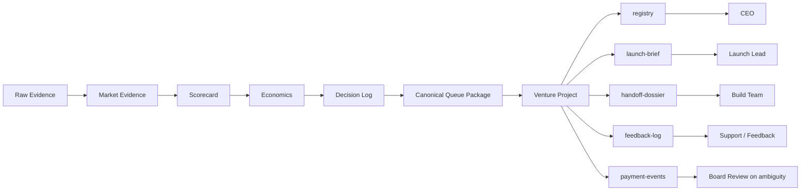

# NoHum Atlas: Artifact And Knowledge Flow

Date: 2026-03-28

## Intent

This diagram answers one question:

Where does knowledge go, who owns it, and what becomes source of truth?

## Pattern

This area is deliberately influenced by the memory and handoff patterns from `agency-agents`.

The core rule for NoHum:

- handoffs should happen through canonical artifacts
- not through fragile comments and copy-paste summaries

## Diagram

## Ownership Rule

- research artifacts are owned by the research machine
- venture artifacts are owned by the venture lane
- `payment-events` is append-only
- `registry` holds derived state, not raw event history

## Storage Rule

The desired runtime end-state is:

- durable issue documents for canonical artifacts
- reusable templates for venture documents
- minimal hidden state
- no important transitions living only in chat comments
