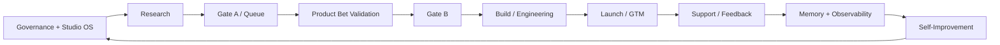

# Factory Module Map

This is the architect-facing and agent-facing index of NoHum factory modules.
Use it to find the module passport, canonical process, ontology states,
agents, tools, outputs, and known documentation drift.

For the documentation format itself, use
[Module Documentation Standard](./module-documentation-standard.md).

## Factory Lifecycle

## Module Index

| Module | Runtime stage | Current passport | Process/playbook | Ontology | Agents/source | Tools/cost | Current status |
|---|---|---|---|---|---|---|---|
| Governance + Studio OS | always on | [Operating Spec](../operating-spec.md) | [Governance Runtime](./governance-and-runtime.md) | [ONT-00..03, ONT-07](../ontology/nohum-operating-ontology.md) | [Org Map](./org-map.md), [MCP Matrix](../mcp-access-matrix.md) | [MCP Matrix](../mcp-access-matrix.md) | `PARTIAL`: strong policy, no single module passport yet |
| Research | pre-Gate-A | [Research README](../research/README.md) | [Research Playbook](../playbooks/research-playbook.md), [Research Machine](./research-machine.md) | [ONT-04](../ontology/nohum-operating-ontology.md) | Research team in [Team Skill Matrix](../team-skill-matrix.md) | [MCP Matrix](../mcp-access-matrix.md) | `GOOD`: module passport upgraded to canonical format |
| Gate A / Queue | queue decision | [Gate A Mini-Passport](../readiness/gate-a-readiness.md) | [Queue Gate A Playbook](../playbooks/queue-gate-a-playbook.md), [Queue To Venture Machine](../automation/queue-to-venture-machine.md) | [ONT-04, ONT-07](../ontology/nohum-operating-ontology.md) | CEO + Research Lead | Paperclip approvals | `GOOD`: mini-passport upgraded to canonical gate format |
| Product Bet Validation | post-Gate-A, pre-Gate-B | [Product Bet README](../product-bets/README.md) | [Product Bet Playbook](../playbooks/product-bet-definition-playbook.md) | [ONT-05..05C, ONT-06](../ontology/nohum-operating-ontology.md) | [Product Bet Agents](../product-bets/README.md#product-bet-agents) | [Tool Access](../product-bets/tool-access-matrix.md), [Cost Registry](../product-bets/tool-cost-registry.md) | `GOOD`: strongest module passport, still needs recurring drift checks |
| Gate B | build permission | [Gate B Mini-Passport](../readiness/gate-b-readiness.md) | [Gate B Playbook](../playbooks/gate-b-playbook.md) | [ONT-05, ONT-07](../ontology/nohum-operating-ontology.md) | CEO/Board + Launch Lead + Evidence Router | approval + evidence refs | `GOOD`: mini-passport upgraded to canonical gate format |
| Build / Engineering | post-Gate-B | [Build Module](../build/README.md) | [Build Playbook](../playbooks/build-playbook.md), [Definition To Build Handoff](../handoffs/definition-to-build.md) | [ONT-05D, ONT-06](../ontology/nohum-operating-ontology.md) | VP Engineering team in [Team Skill Matrix](../team-skill-matrix.md#engineering-team) | GitHub/Railway/Sentry stack in [MCP Matrix](../mcp-access-matrix.md) | `GOOD`: module passport added with state/decision model |
| Launch / GTM | post-build/pre-portfolio | [Launch Readiness](../readiness/launch-readiness.md) | [Launch Playbook](../playbooks/launch-playbook.md), [Launch Machine](./launch-machine.md) | launch states are broad in operating spec, not detailed in ontology | Launch/Marketing teams in [Team Skill Matrix](../team-skill-matrix.md) | analytics/payment/email/deploy tools | `WEAK`: Product Launch and Marketing are mixed |
| Support / Feedback | launched products | no module passport | [Operate Feedback Playbook](../playbooks/operate-feedback-playbook.md), [Launch To Support Handoff](../handoffs/launch-to-support.md) | support states not detailed in ontology | Support Lead team in [MCP Matrix](../mcp-access-matrix.md) | analytics/payment/support surfaces | `WEAK`: lacks object/state/decision model |
| Memory + Observability | cross-cutting | [Artifact Flow](./artifact-and-knowledge-flow.md), [Product Bet Memory](../product-bets/product-bet-memory.md), [Research History](../research/history-layer.md) | [Factory Health Metrics](../observability/factory-health-metrics.md) | [ONT-10](../ontology/nohum-operating-ontology.md) | owners per memory surface | Paperclip knowledge + metrics | `PARTIAL`: good per-lane docs, no factory-wide memory passport |
| Self-Improvement | cross-cutting | [Studio Self-Improvement Playbook](../playbooks/studio-self-improvement-playbook.md) | [Self-Improvement Machine](./self-improvement-machine.md) | improvement states are partial | Chief of Staff + Agent Mechanic | Paperclip, repo, validators | `PARTIAL`: concept strong, promotion/eval mechanics need more enforcement |
| Import / Runtime Substrate | bootstrap/recovery | [Import Runbook](../import-runbook.md), [Server Post Import Checklist](../server-post-import-checklist.md) | [Company Knowledge Import](../runbooks/company-knowledge-import.md), [Access And Secrets Bring-Up](../runbooks/company-access-and-secrets-bring-up.md) | [ONT-01, ONT-11](../ontology/nohum-operating-ontology.md) | CEO + Agent Mechanic | Paperclip API, company secrets, runtime checks | `PARTIAL`: improved, but runtime sync must be checked every import |

## Documentation Review

### What Is Strong

- The repo now has a clear ontology layer, especially for Research and Product
  Bet state discipline.
- Product Bet has the strongest module passport: doctrine, runtime contract,
  loop map, agents, outputs, observation policy, hard Gate B criteria, tool
  matrix, cost registry, memory docs, and templates.
- Research uses a canonical-card pattern with derived history surfaces and now
  has a module passport in the shared format.
- Gate A now has a mini-passport that separates `QUEUE`, Gate A packet
  readiness, Gate A approval, and Product Bet sprint activation.
- Gate B now has a mini-passport that separates Evidence Router
  recommendation, accepted-risk review, Gate B approval, and build activation.
- Build now has a module passport that separates Gate B approval, handoff
  acceptance, repo attach, environment readiness, architecture,
  implementation, review, QA, risk review, release readiness, and Launch
  handoff.
- Old RAT agents and templates are mechanically blocked by
  `scripts/check-package-drift.mjs`.
- All agents currently have the expected companion-file pattern:
  `AGENTS.md`, `SOUL.md`, `HEARTBEAT.md`, and `TOOLS.md`.

### Active Drift

- Most modules do not yet follow one canonical passport structure. Product Bet,
  Research, Gate A, Gate B, and Build now do; Launch, Support, and Runtime
  Substrate do not.
- `Product Launch Team` and `Product Bet Validation Team` are adjacent but not
  cleanly separated in the documentation. Product Bet is pre-Gate-B; Product
  Launch is post-Gate-B or launch-readiness work.
- The global [MCP Matrix](../mcp-access-matrix.md) and
  [Team Skill Matrix](../team-skill-matrix.md) are useful, but they are too
  large to be the first document an agent reads for a module.
- The ontology is strong but not yet complete for Launch, Support, and
  Self-Improvement state machines.

### Recently Corrected Drift

- Active Product Bet hardening files used the phrase `validation risk test`.
  That wording was replaced with `selected-test-revision` and `external
  validation` language to avoid pulling the old RAT frame back into active
  Product Bet work.

### Stale Or Risky Areas To Review Next

- `docs/nohum-board-map-2026-03-28.md` and
  `docs/runtime-state-2026-03-28.md` are useful history but date-stamped. They
  should be treated as snapshot references, not current module passports.
- Broad Marketing skills such as `gtm-strategy`, `gtm-motions`, and
  `growth-loops` are valid for Marketing/Launch, but should not be interpreted
  as Product Bet pre-Gate-B kernel skills.
- Support lacks the same object/state/decision rigor that now exists in
  Product Bet and Build. Launch/GTM still needs a clean passport to prevent
  marketing scope from leaking back into Product Bet.

## Required Next Passports

Priority order:

1. Launch/GTM module passport: separate post-build launch from pre-Gate-B
   Product Bet validation.
2. Support/Feedback module passport: support object model, escalation,
   customer harm, payment ambiguity, feedback-to-memory loop.
3. Self-Improvement module passport: experiment states, eval rings, promotion,
   rollback, and forbidden self-editing.

## Architect Review Rule

When reviewing a module, always answer two questions:

1. `consequence_fix`: what is broken in active runtime and how do we return it
   to the intended process?
2. `cause_fix`: what repo doc, agent instruction, skill, validator, runtime
   sync, or eval prevents this from recurring?

If only the consequence is fixed, the architecture is not fixed.
