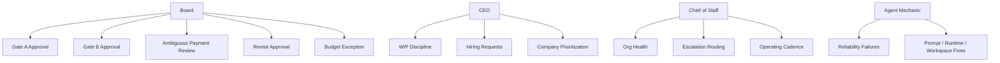

# NoHum Atlas: Governance And Runtime

Date: 2026-03-28

## Intent

This document combines two concerns:

- governance
- agent runtime settings

These should be reviewable together because a badly configured runtime breaks governance.

## Governance Diagram

## Runtime Rule

Every mature agent should eventually have:

- local `AGENTS.md`
- local `SOUL.md`
- local `HEARTBEAT.md`
- local `TOOLS.md`
- explicit skills
- explicit permissions
- explicit workspace access
- explicit heartbeat interval

## Current Live Notes

- `CEO`
  - `LIVE`
  - full four-file bundle present
- `Chief of Staff`
  - `LIVE`
  - full four-file bundle present
- `Agent Mechanic`
  - `LIVE`
  - full four-file bundle present
- `Research Lead`
  - `LIVE`
  - full four-file bundle present
- `Launch Lead`
  - `LIVE`
  - full four-file bundle present
- `VP of Engineering 2`
  - `LIVE / DRIFTED`
  - full managed four-file bundle present
  - active runtime slug is `vp-of-engineering-2`, while the repo-owned package path is still `agents/vp-engineering`

## Runtime Drift Notes

- managed runtime bundles currently match repo source after the expected `AGENTS.md` frontmatter stripping step during import/sync
- the previously reported missing `SOUL.md`, `HEARTBEAT.md`, and `TOOLS.md` overlay problem for `Agent Mechanic` is no longer present
- the remaining meaningful runtime/package drift is the duplicate engineering manager surface: terminated `vp-engineering` versus active `vp-of-engineering-2`

## Restriction Board

- one active venture plus one queued venture
- no build before Gate B
- no portfolio pass without valid payment or board resolution
- payment ambiguity never guessed
- no major hidden state
- no agent should depend on a single monolithic prompt forever
