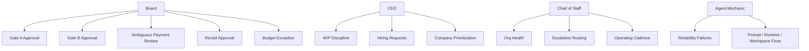

# NoHum Atlas: Governance And Runtime

Date: 2026-03-28

## Intent

This document combines two concerns:

- governance
- agent runtime settings

These should be reviewable together because a badly configured runtime breaks governance.

## Governance Diagram

## Runtime Rule

Every mature agent should eventually have:

- local `AGENTS.md`
- local `SOUL.md`
- local `HEARTBEAT.md`
- local `TOOLS.md`
- explicit skills
- explicit permissions
- explicit workspace access
- explicit heartbeat interval

## Current Live Notes

- `CEO`
  - `LIVE`
  - full four-file bundle present
- `Chief of Staff`
  - `LIVE`
  - full four-file bundle present
- `Agent Mechanic`
  - `LIVE / PARTIAL`
  - only `AGENTS.md` present today
- `Research Lead`
  - `LIVE`
  - full four-file bundle expected
- `Launch Lead`
  - `LIVE`
  - full four-file bundle expected

## Restriction Board

- one active venture plus one queued venture
- no build before Gate B
- no portfolio pass without valid payment or board resolution
- payment ambiguity never guessed
- no major hidden state
- no agent should depend on a single monolithic prompt forever
