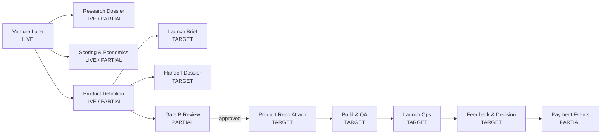

# NoHum Atlas: Launch Machine

Date: 2026-03-28

## Intent

This diagram shows how an approved venture should move from venture lane to launch-ready substrate.

## Diagram

## Team Participation

- `Launch Lead`
  - owns Gate B readiness
- `Product Definer`
  - ICP, JTBD, offer, pricing, MVP boundary
- `Dev Lead`
  - build slicing and execution reliability
- `Growth Lead`
  - launch channel, landing, analytics
- `Support Lead`
  - customer feedback loop and support signal capture
- `Venture Research Analyst`
  - embedded market/pricing refinement during launch

## Required Venture Artifacts

- `registry`
- `launch-brief`
- `decision-log`
- `feedback-log`
- `payment-events`
- `handoff-dossier`

## Current Reality

The live venture lane exists.

The full launch machine does not yet exist as repeatable runtime behavior.
