# NoHum Detailed-Core Org Map

```mermaid
graph TD
  CEO["CEO"]
  COS["Chief of Staff"]
  AM["Agent Mechanic"]
  RL["Research Lead"]
  LL["Launch Lead"]
  CMO["CMO"]
  VPE["VP of Engineering"]
  SL["Support Lead"]

  CEO --> COS
  CEO --> RL
  CEO --> LL
  CEO --> CMO
  CEO --> VPE
  CEO --> SL
  COS --> AM

  RL --> IS["Idea Scout"]
  RL --> CS["Competitor Scout"]
  RL --> DV["Demand Validator"]
  RL --> RV["Revenue Validator"]

  LL --> PD["Product Definer"]
  LL --> UXR["UX Researcher"]
  LL --> UXA["UX Architect"]
  LL --> UID["UI Designer"]
  LL --> PS["Pricing Strategist"]
  LL --> LPM["Launch Program Manager"]

  CMO --> GL["Growth Lead"]
  CMO --> MS["Marketing Strategist"]
  CMO --> SEO["SEO Specialist"]
  CMO --> CC["Content Creator"]
  CMO --> PMS["Paid Media Strategist"]
  CMO --> TMS["Tracking & Measurement Specialist"]
  CMO --> CB["Community Builder"]
  CMO --> AIC["AI Citation Strategist"]

  VPE --> SA["Software Architect"]
  VPE --> BA["Backend Architect"]
  VPE --> FD["Frontend Developer"]
  VPE --> AIE["AI Engineer"]
  VPE --> SD["Senior Developer"]
  VPE --> DO["DevOps Automator"]
  VPE --> SRE["SRE"]
  VPE --> SEC["Security Engineer"]
  VPE --> CR["Code Reviewer"]
  VPE --> QAD["QA Director"]
  VPE --> QAE["QA Engineer"]
  VPE --> RE["Release Engineer"]

  SL --> SR["Support Responder"]
  SL --> FS["Feedback Synthesizer"]
  SL --> AR["Analytics Reporter"]
```

## Notes

- `launch-lead` remains exact-parity import-safe core but now owns only Product Launch.
- `growth-lead` now reports to `cmo`.
- `code-reviewer` and `release-engineer` now report to `vp-engineering`.
- Design stays inside Product Launch instead of becoming a standalone department.
