# NoHum v1.8 Single-Import Org Map

```mermaid
graph TD
  CEO["CEO"]
  COS["Chief of Staff"]
  AM["Agent Mechanic"]
  RL["Research Lead"]
  LL["Launch Lead"]
  CMO["CMO"]
  VPE["VP of Engineering"]
  SL["Support Lead"]

  CEO --> COS
  CEO --> RL
  CEO --> LL
  CEO --> CMO
  CEO --> VPE
  CEO --> SL
  COS --> AM

  RL --> IS["Idea Scout"]
  RL --> CS["Competitor Scout"]
  RL --> DV["Demand Validator"]
  RL --> RV["Revenue Validator"]

  LL --> PBC["Product Bet Compiler"]
  LL --> CDDA["Competitor Deep Dive Analyst"]
  LL --> EM["Economics Modeler"]
  LL --> OPS["Offer & Positioning Strategist"]
  LL --> OTS["Organic Traffic Strategist"]
  LL --> PMA["Pre-Market Autoreasoner"]
  LL --> LSB["Landing Surface Builder"]
  LL --> PBMS["Product Bet Measurement Specialist"]
  LL --> ER["Evidence Router"]

  LL --> PD["Product Definer"]
  LL --> UXR["UX Researcher"]
  LL --> UXA["UX Architect"]
  LL --> UID["UI Designer"]
  LL --> PS["Pricing Strategist"]
  LL --> LPM["Launch Program Manager"]

  CMO --> GL["Growth Lead"]
  CMO --> MS["Marketing Strategist"]
  CMO --> SEO["SEO Specialist"]
  CMO --> CC["Content Creator"]
  CMO --> PMS["Paid Media Strategist"]
  CMO --> TMS["Tracking & Measurement Specialist"]
  CMO --> CB["Community Builder"]
  CMO --> AIC["AI Citation Strategist"]

  VPE --> SA["Software Architect"]
  VPE --> BA["Backend Architect"]
  VPE --> FD["Frontend Developer"]
  VPE --> AIE["AI Engineer"]
  VPE --> SD["Senior Developer"]
  VPE --> DO["DevOps Automator"]
  VPE --> SRE["SRE"]
  VPE --> SEC["Security Engineer"]
  VPE --> CR["Code Reviewer"]
  VPE --> QAD["QA Director"]
  VPE --> QAE["QA Engineer"]
  VPE --> RE["Release Engineer"]

  SL --> SR["Support Responder"]
  SL --> FS["Feedback Synthesizer"]
  SL --> AR["Analytics Reporter"]
```

## Notes

- The root package imports the whole org library in one pass.
- Only bootstrap tasks are live on day one; Research, Product Bet, Build, GTM,
  and Support work starts from manager-created tasks after gates.
- Product Bet Validation specialists report to `launch-lead` but stay dormant
  until CEO approves Gate A and creates a Product Bet Validation Sprint.
- Product Launch specialists also report to `launch-lead`, but they activate
  after Gate B when build/launch definition is approved.
- `growth-lead` now reports to `cmo`.
- `code-reviewer` and `release-engineer` now report to `vp-engineering`.
- Design stays inside Product Launch instead of becoming a standalone department.
