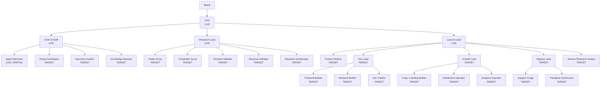

# NoHum Atlas: Org Map

Date: 2026-03-28

## Intent

This diagram shows reporting lines and role intent.

It does not describe business flow. It describes org shape.

## Role Notes

- `CEO`
  - studio allocator and gate owner
- `Chief of Staff`
  - operating cadence, execution reliability, org health, escalation routing
- `Agent Mechanic`
  - agent reliability engineer; fixes why agents do not execute properly
- `Research Lead`
  - owns research pod quality and queue package quality bar
- `Launch Lead`
  - owns venture execution from Product Definition through launch readiness

## Live vs Target

- `CEO`: `LIVE`
- `Chief of Staff`: `LIVE`
- `Agent Mechanic`: `LIVE`, but file bundle incomplete
- `Research Lead`: `LIVE`
- `Launch Lead`: `LIVE`
- specialists under the leads: `TARGET`

## Diagram

## Settings Principle

Every agent should eventually own:

- local `AGENTS.md`
- local `SOUL.md`
- local `HEARTBEAT.md`
- local `TOOLS.md`
- per-agent skills
- per-agent permissions
- per-agent heartbeat timing
- per-agent budget cap
- per-agent workspace access policy
