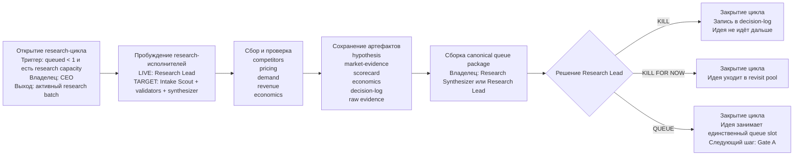

# NoHum Atlas: Детальный research-контур

Дата: 2026-03-28

## Зачем нужен этот документ

Это детальная расшифровка блоков `2-4` из общей схемы `Operating Sequence`:

- открытие research-цикла
- работа research-машины
- решение по очереди

Он отвечает на вопросы:

- кто просыпается
- как часто это происходит
- где сохраняются результаты
- как выглядит handoff
- как цикл заканчивается

## 1. Короткий смысл контура

Research-контур существует не для “производства идей”, а для одной очень узкой цели:

- превратить сырую идею в один из трёх выходов:
  - `KILL`
  - `KILL FOR NOW`
  - `QUEUE`

При этом:

- `QUEUE` может быть только один
- research WIP ограничен
- выход должен быть оформлен каноническим пакетом, а не просто комментарием

## 2. Схема research-контура

## 3. Кто именно просыпается

### Текущее live-состояние

- `CEO`
  - открывает research-цикл, когда в очереди пусто и есть capacity
- `Research Lead`
  - сейчас фактически делает почти весь контур
- `Chief of Staff`
  - просыпается только если контур застрял или ownership неясен
- `Agent Mechanic`
  - просыпается только если агентные ранны “зелёные”, а полезного выхода нет, либо сломан runtime

### Целевое зрелое состояние

- `CEO`
  - решает, что слот research вообще надо открыть
- `Research Lead`
  - держит quality bar и финальное решение
- `Intake Scout`
  - превращает raw idea в нормальный research case
- `Competitor Scout`
  - доказывает прямых конкурентов и pricing
- `Demand Validator`
  - доказывает спрос через search / traffic / reviews / adoption
- `Revenue Validator`
  - доказывает monetization reality, price bands и путь к first payment
- `Research Synthesizer`
  - собирает канонический queue package

## 4. Как часто это запускается

### Не по жёсткому cron как основная логика

Главный триггер research-контура не heartbeat сам по себе, а:

- `queue slot empty`
- `research capacity available`
- `CEO or control plane decides to source`

### Heartbeat нужен как polling safety net

Текущие live интервалы:

- `CEO`: `4500` секунд
- `Research Lead`: `9000` секунд

Правильная логика такая:

- heartbeat проверяет, не пора ли двигать процесс
- `wakeOnDemand` используется для реального старта работы
- когда появился новый issue, новый handoff или review feedback:
  - агент лучше будить вручную или event-driven, а не ждать heartbeat

### Практическое правило

- новый research batch открывается только когда:
  - `queued < 1`
  - `research < 10`
  - нет более приоритетного venture-blocker

## 5. Где сохраняются результаты

Research-контур должен складывать данные в `Hypothesis Funnel`.

### Канонические документы issue

- `hypothesis`
- `market-evidence`
- `scorecard`
- `economics`
- `decision-log`

### Отдельно хранится

- `raw evidence`
  - attachments
  - ссылки
  - source artifacts

### Финальный research-выход

- `canonical queue package`

Это и есть главный handoff-артефакт research-контура.

## 6. Как выглядит handoff

Правильный handoff research-контура выглядит так:

1. `Intake Scout` или `Research Lead`
- создаёт нормальный research case

2. `Competitor Scout`
- передаёт:
  - список прямых конкурентов
  - pricing links
  - краткий вывод по категории

3. `Demand Validator`
- передаёт:
  - demand signals
  - freshness
  - confidence
  - ссылки на evidence

4. `Revenue Validator`
- передаёт:
  - price band
  - путь к first payment
  - путь к `$5k MRR`
  - ограничения и риски

5. `Research Synthesizer`
- собирает:
  - hard-gates matrix
  - weighted score
  - economics summary
  - strongest runner-up comparison
  - final recommendation

6. `Research Lead`
- выносит финальный вердикт:
  - `KILL`
  - `KILL FOR NOW`
  - `QUEUE`

### Ключевое правило handoff

Передача идёт через:

- issue docs
- canonical queue package

А не через:

- случайные comments-only summary
- устные договорённости
- память человека

## 7. Как цикл заканчивается

Research-контур считается завершённым только в одном из трёх случаев:

### Случай 1. `KILL`

- причина записана в `decision-log`
- очередь не занята
- цикл закрыт

### Случай 2. `KILL FOR NOW`

- причина записана в `decision-log`
- идея уходит в `revisit pool`
- цикл закрыт

### Случай 3. `QUEUE`

- собран `canonical queue package`
- winner занимает единственный queue slot
- research-контур закрыт
- следующий шаг уже не research, а `Gate A`

## 8. Что является хорошим research-результатом

Research-контур завершён правильно, если в конце есть:

- понятный `venture_id`
- hard-gates matrix
- weighted score по контракту
- evidence links
- confidence и freshness
- economics summary
- binary outcome:
  - `KILL`
  - `KILL FOR NOW`
  - `QUEUE`

Если этого нет, research завершён не системно, даже если агент “выглядит умным”.

## 9. Разница между LIVE и TARGET

### LIVE сейчас

- почти весь контур держится на `Research Lead`
- quality bar уже есть
- queue package уже существует
- артефакты уже складываются в систему

### TARGET

- research работает как pod
- handoff идёт между специалистами
- `Chief of Staff` следит за cadence
- `Agent Mechanic` чинит надёжность исполнения
- результаты сохраняются repeatably и одинаково
