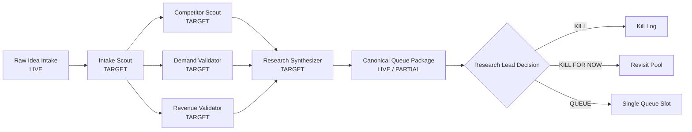

# NoHum Atlas: Research Machine

Date: 2026-03-28

## Intent

This diagram shows how research should work as a machine, not as one smart generalist.

## Borrowed Pattern

The design is intentionally influenced by the best parts of `agency-agents`:

- separate specialists by deliverable
- explicit handoffs
- memory-backed transfer of outputs
- synthesis as a distinct role, not an accidental side effect

## Outputs

The research machine is allowed to end with only:

- `KILL`
- `KILL FOR NOW`
- `QUEUE`

## Diagram

## Source Classes

Research should explicitly pull from these classes:

- competitors
- pricing pages
- traffic or usage proof
- revenue or payment proof
- reviews or buyer adoption proof
- official platform docs where relevant

## Data Contract

Outputs should be stored as:

- raw evidence
- market evidence
- scorecard
- economics
- decision log
- canonical queue package

## Current Gap

Today most of this is still compressed into `Research Lead`.

That is good enough for calibration, but not enough for a finished machine.
