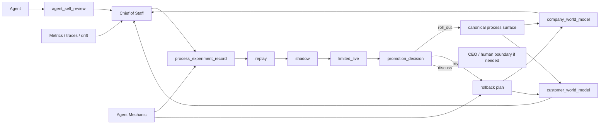

# NoHum Atlas: Self-Improvement Machine

Date: 2026-04-09

## Diagram

## Notes

- `Chief of Staff` is the fleet optimizer, not a manual coordinator
- `Agent Mechanic` implements and contains changes
- human boundaries remain only for governance-sensitive changes
