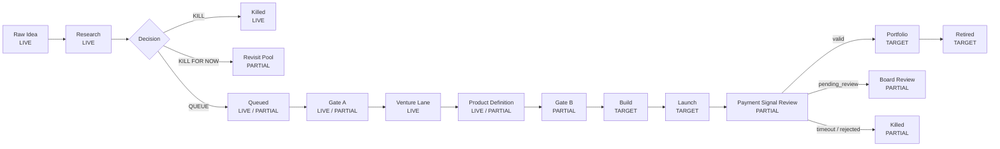

# NoHum Atlas: Venture Lifecycle

Date: 2026-03-28

## Intent

This diagram shows the business lifecycle of a venture, not the reporting map.

## Core Constraints

- one active venture plus one queued venture
- `research <= 10`
- `queued <= 1`
- `build/launch <= 1`
- `14 days` from `build_start_at` to valid first payment
- `pending_review` payment can pause auto-kill for at most `48h`

## Diagram

## Stage Ownership

- `raw -> research`
  - `Research Lead`
- `research -> queued`
  - `Research Lead`
- `queued -> venture (Gate A)`
  - `CEO + board`
- `venture -> build (Gate B)`
  - `Launch Lead + CEO + board`
- `launch -> portfolio`
  - system on valid payment, board on ambiguous payment

## Current Reality

The company already has:

- `Hypothesis Funnel`
- one completed queue package
- one live venture lane

What is still missing as hard machine behavior:

- idempotent `Promote To Venture`
- idempotent `Attach Product Repo`
- operational payment signal pipeline
