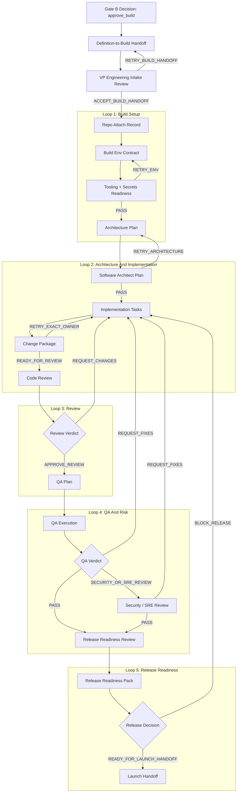
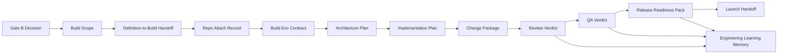

# Build Module

This is the canonical module passport for NoHum post-Gate-B engineering work.
Use it before creating, accepting, reviewing, QA-ing, or releasing any build
task.

Build is not Product Bet Validation. Build starts only after Gate B has
approved a scoped implementation boundary.

## Search Keys

- `BUILD-00` doctrine
- `BUILD-01` activation boundary
- `BUILD-02` process map
- `BUILD-03` runtime objects
- `BUILD-04` states
- `BUILD-05` decisions
- `BUILD-06` agents
- `BUILD-07` skills and tools
- `BUILD-08` memory
- `BUILD-09` outputs
- `BUILD-10` failure modes
- `BUILD-11` source map

## BUILD-00 Doctrine

```text
Gate B owns build permission.
Build implements the approved scope; it does not redefine the product bet.
Engineering starts from a handoff dossier, not comment threads.
Architecture, implementation, review, QA, and release are separate gates.
No role approves its own work.
Release readiness requires rollback, verification, and operational ownership.
```

Hard boundaries:

- No Build work before `gate_b_decision = approve_build`.
- No broad launch, paid marketing, payment claims, or support promises from the
  Build module alone.
- No scope expansion beyond `build_scope` without CEO/board decision.
- No stack exception unless the exception was approved before or during Gate B.
- No release claim without review verdict, QA verdict, release readiness pack,
  and rollback plan.

## BUILD-01 Activation Boundary

Build can start when all required inputs exist:

| Input | Owner | Required content |
|---|---|---|
| `gate_b_decision` | CEO / Board | explicit `approve_build`; accepted risks are recorded inside the decision contract |
| `gate_b_recommendation` | Evidence Router | evidence route, criteria result, risks |
| `build_scope` | Launch Lead / CEO | what to build, what not to build, MVP boundary |
| `definition_to_build_handoff` | Launch Lead | acceptance criteria, UX notes, product constraints |
| `stack_exception_packet` | CEO / Board, if needed | only if default stack is insufficient |

If any input is missing, VP Engineering must return `RETRY_BUILD_HANDOFF` to
Launch Lead or CEO. The correct state is `build_handoff_retry`, not
`implementation_in_progress`.

## BUILD-02 Process Map



This map is intentionally conservative. It is cheaper to keep review, QA, and
release separate than to debug a product that shipped from a single builder's
self-assessment.

## BUILD-03 Runtime Objects

| Object | Definition | Owner | Canonical source |
|---|---|---|---|
| `build_scope` | approved implementation boundary after Gate B | Launch Lead / CEO | Gate B decision + build brief |
| `definition_to_build_handoff` | product-to-engineering transfer packet | Launch Lead | handoff dossier |
| `repo_attach_record` | product repo identity and attachment record | VP Engineering | repo attach artifact |
| `build_env_contract` | runtime env, secrets, deployment, and CI contract | DevOps Automator / VP Engineering | env contract artifact |
| `architecture_plan` | implementation decomposition and technical constraints | Software Architect | architecture plan |
| `implementation_plan` | task split, owners, verification plan | VP Engineering / Software Architect | engineering plan |
| `change_package` | implementation diff plus verification evidence | assigned implementer | repo / PR / worktree |
| `review_verdict` | code-review decision with evidence | Code Reviewer | review artifact |
| `qa_verdict` | QA decision with executed scenarios | QA Director / QA Engineer | QA artifact |
| `release_readiness_pack` | release checklist, risks, rollback, observability | Release Engineer | release pack |
| `launch_handoff` | release-ready package passed to Launch/GTM | VP Engineering | handoff artifact |

## BUILD-04 States

| State | Meaning | Required next owner |
|---|---|---|
| `gate_b_approved` | CEO/board approved scoped build | Launch Lead |
| `build_handoff_ready` | handoff dossier exists | VP Engineering |
| `build_intake_review` | VP Engineering is checking completeness | VP Engineering |
| `build_handoff_retry` | handoff is incomplete or contradictory | Launch Lead / CEO |
| `repo_attach_ready` | product repo can be attached or created | VP Engineering |
| `repo_attached` | repo identity is canonical | VP Engineering |
| `build_env_ready` | secrets, CI, deploy, and runtime contract are usable | DevOps Automator |
| `architecture_plan_ready` | technical plan is scoped and reviewable | Software Architect |
| `implementation_in_progress` | implementation tasks are active | assigned implementers |
| `review_ready` | change package is ready for code review | Code Reviewer |
| `code_review` | reviewer is evaluating changes | Code Reviewer |
| `review_retry` | exact implementation owner must address review findings | assigned implementer |
| `qa_ready` | reviewed package is ready for QA | QA Director |
| `qa_execution` | QA scenarios are running | QA Engineer / QA Director |
| `qa_retry` | exact owner must fix failed scenarios | assigned implementer |
| `risk_review` | Security/SRE review is required | Security Engineer / SRE |
| `release_readiness_review` | release pack and rollback are being evaluated | Release Engineer |
| `release_blocked` | release cannot proceed until named blocker is fixed | VP Engineering |
| `launch_handoff_ready` | build can move to Launch/GTM handoff | Launch Lead / CEO |

## BUILD-05 Decisions

| Decision | From | To | Owner | Required evidence |
|---|---|---|---|---|
| `accept_build_handoff` | `build_intake_review` | `repo_attach_ready` | VP Engineering | Gate B decision, scope, handoff dossier |
| `retry_build_handoff` | `build_intake_review` | `build_handoff_retry` | VP Engineering | exact missing or conflicting input |
| `attach_repo` | `repo_attach_ready` | `repo_attached` | VP Engineering | repo attach record |
| `approve_build_env` | `repo_attached` | `build_env_ready` | DevOps Automator / VP Engineering | env contract, secrets, CI/deploy checks |
| `approve_architecture_plan` | `build_env_ready` | `architecture_plan_ready` | VP Engineering | architecture plan |
| `start_implementation` | `architecture_plan_ready` | `implementation_in_progress` | VP Engineering | task split and verification plan |
| `submit_change_package` | `implementation_in_progress` | `review_ready` | implementer | diff, tests, manual evidence |
| `approve_code_review` | `code_review` | `qa_ready` | Code Reviewer | review verdict with evidence |
| `request_review_changes` | `code_review` | `review_retry` | Code Reviewer | exact findings and owner |
| `approve_qa` | `qa_execution` | `release_readiness_review` | QA Director | QA verdict |
| `request_qa_fixes` | `qa_execution` | `qa_retry` | QA Director | failed scenarios and owner |
| `approve_risk_review` | `risk_review` | `release_readiness_review` | Security Engineer / SRE | risk review artifact |
| `block_release` | `release_readiness_review` | `release_blocked` | Release Engineer / VP Engineering | blocker, rollback, or verification gap |
| `approve_release_readiness` | `release_readiness_review` | `launch_handoff_ready` | Release Engineer / VP Engineering | release readiness pack |

## BUILD-06 Agents

| Agent | Owns | Inputs | Outputs | Cannot approve |
|---|---|---|---|---|
| `vp-of-engineering` | build orchestration, intake, gates, engineering risk | Gate B decision, handoff dossier | engineering plan, gate decisions, launch handoff | own implementation without review/QA |
| `software-architect` | architecture plan and decomposition | build scope, repo context | architecture plan | release readiness |
| `backend-architect` | backend contracts, data model, server behavior | architecture plan | backend implementation/review notes | scope expansion |
| `frontend-developer` | frontend implementation | architecture plan, UX notes | UI changes, tests, evidence | design/product approval |
| `ai-engineer` | AI behavior, evals, prompts, model/tool surfaces | approved AI scope | AI implementation + eval evidence | unsupported behavior claims |
| `senior-developer` | implementation across approved scope | assigned tasks | change package | self-review |
| `devops-automator` | CI/CD, deploy, runtime config | repo attach record | build env contract, deploy checks | product scope |
| `sre` | reliability, health, incident readiness | deploy/runtime context | reliability review, canary/rollback notes | product readiness alone |
| `security-engineer` | security review | diff, threat context, secrets paths | security verdict | release approval alone |
| `code-reviewer` | independent code review | change package | review verdict | release/QA approval |
| `qa-director` | QA plan and verdict | accepted review package | QA verdict | code-review approval |
| `qa-engineer` | test execution | QA plan | scenario evidence | QA sign-off alone unless delegated |
| `release-engineer` | release readiness and rollback | review + QA + runtime evidence | release readiness pack | unreviewed release |

## BUILD-07 Skills And Tools

Mandatory operating skills for the Engineering team are listed in
[Team Skill Matrix](../team-skill-matrix.md#engineering-team). The minimum
runtime skill is `paperclip`; implementation roles also use repo-local
engineering skills such as planning, TDD, systematic debugging, review, QA,
ship, land-and-deploy, and verification-before-completion.

Tool and credential boundaries are defined in
[MCP Access Matrix](../mcp-access-matrix.md):

| Tool surface | Used for | Typical owner | Secret class |
|---|---|---|---|
| repo/worktree + git/GitHub | source changes, review, CI | engineering roles | `GITHUB_TOKEN` |
| CI/test tooling | verification evidence | implementers, reviewer, QA | `GITHUB_TOKEN` |
| Railway MCP / deploy tooling | runtime deployment and rollback | DevOps Automator, SRE, Release Engineer | `DEPLOY_PROVIDER_TOKEN` |
| Sentry MCP | production diagnostics | SRE, Release Engineer | `SENTRY_AUTH_TOKEN` |
| Playwright/browser QA | smoke tests and UI verification | QA, frontend, release | host-managed |
| Paperclip Knowledge | canonical artifacts and handoffs | managers and reviewers | host-managed |

The canonical app stack is [Factory Default Stack](../factory-default-stack.md).
Any deviation is a governance decision, not an engineering preference.

## BUILD-08 Memory

Build memory is a projection from canonical artifacts, not a replacement for
them.



Persist for later analysis:

- scope changes requested and rejected
- review findings by category and owner
- failed QA scenarios and fixes
- deploy/runtime blockers
- rollback/canary lessons
- test coverage gaps and verification cost

Do not store secrets, raw tokens, or credential values in artifacts, comments,
or memory.

## BUILD-09 Outputs

Minimum Build outputs:

1. `repo_attach_record`
2. `build_env_contract`
3. `architecture_plan`
4. `implementation_plan`
5. `change_package`
6. `review_verdict`
7. `qa_verdict`
8. `release_readiness_pack`
9. `rollback_plan`
10. `launch_handoff`

If an output is skipped, the Build module is not complete. If a role cannot
access the required tool, the correct result is a blocked state with the exact
missing access, not a simulated verdict.

## BUILD-10 Failure Modes

| Failure | Why it breaks the factory | Correct response |
|---|---|---|
| Build starts before Gate B | bypasses validation and board authority | block and return to Gate B |
| comments-only handoff | loses source of truth and acceptance criteria | `retry_build_handoff` |
| scope drift during implementation | rewrites product bet after approval | escalate to CEO/board |
| unapproved stack deviation | increases operational burden silently | request stack exception |
| repo created without attach record | breaks ownership and deployment trail | create/repair repo attach record |
| secrets pasted into tasks/docs | governance and security failure | rotate/clean up; use Company Secrets |
| implementer self-approves | collapses review gate | send to Code Reviewer |
| QA skipped after review | release quality becomes opinion | send to QA Director |
| release without rollback | makes launch unsafe | block release |
| Build claims launch success | mixes Build and Launch/GTM | hand off to Launch module |

## BUILD-11 Source Map

Primary sources:

- [Operating Ontology](../ontology/nohum-operating-ontology.md)
- [Gate B Mini-Passport](../readiness/gate-b-readiness.md)
- [Build Playbook](../playbooks/build-playbook.md)
- [Definition To Build Handoff](../handoffs/definition-to-build.md)
- [Factory Default Stack](../factory-default-stack.md)
- [Team Skill Matrix](../team-skill-matrix.md#engineering-team)
- [MCP Access Matrix](../mcp-access-matrix.md)
- [VP of Engineering Agent](../../agents/vp-of-engineering/AGENTS.md)
