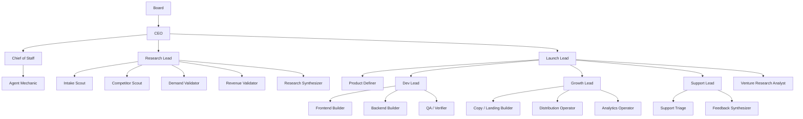
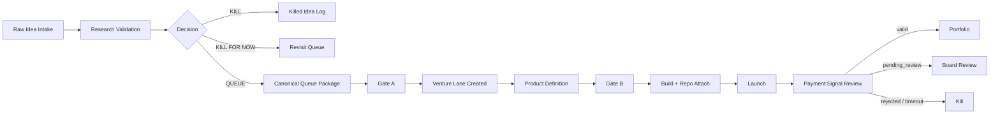
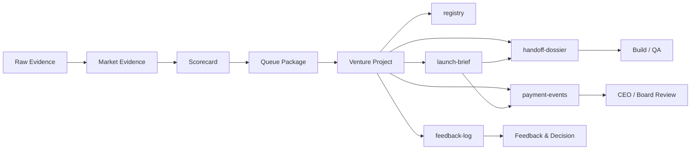
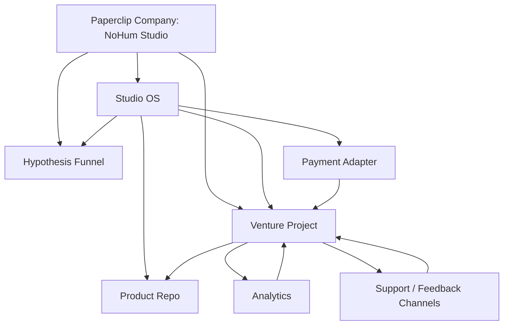

# NoHum Board Map

Date: 2026-03-28

This document is the short board-facing system map for NoHum Studio.

It is meant for:

- Zoom whiteboarding
- Miro mapping
- founder review
- org and runtime discussion

## 1. Core Rule

Every agent should eventually have its own local runtime bundle:

- `AGENTS.md`
- `SOUL.md`
- `HEARTBEAT.md`
- `TOOLS.md`

And every agent should also have its own:

- skills set
- permissions
- heartbeat timing
- budget cap
- workspace access policy

This is the target operating model. It is stricter than the current live state.

## 2. Live Findings: New Roles

### Chief of Staff

Live role intent:

- owns company operating cadence
- owns org health and execution reliability
- detects stalled work and unclear ownership
- reroutes escalation before it clogs the CEO
- treats the agent org itself as a system to tune

Live reporting line:

- reports to `CEO`

Live file state:

- `AGENTS.md` present
- `SOUL.md` present
- `HEARTBEAT.md` present
- `TOOLS.md` present

Live quality note:

- there is also a stray typo file `HEARBEAT.md`
- that should be cleaned later

### Agent Mechanic

Live role intent:

- owns agent reliability
- diagnoses why agents do not act even when runs succeed
- inspects prompt, instructions path, workspace, runtime, tools, and environment
- repairs the smallest durable execution failure
- escalates repeated reliability failures to Chief of Staff

Live reporting line:

- reports to `Chief of Staff`

Live file state:

- `AGENTS.md` present
- `SOUL.md` missing
- `HEARTBEAT.md` missing
- `TOOLS.md` missing

Verdict:

- `Chief of Staff` is a real and useful role for NoHum
- `Agent Mechanic` is also a real and useful role
- `Agent Mechanic` should be treated as a first-class system role and brought up to the four-file standard

## 3. Recommended Org Shape

### Top Level

- `Board`
- `CEO`
- `Chief of Staff`
- `Research Lead`
- `Launch Lead`

### Under Chief of Staff

- `Agent Mechanic`
- later:
  - `Hiring Coordinator`
  - `Execution Auditor`
  - `Knowledge Steward`

### Under Research Lead

- `Intake Scout`
- `Competitor Scout`
- `Demand Validator`
- `Revenue Validator`
- `Research Synthesizer`

### Under Launch Lead

- `Product Definer`
- `Dev Lead`
- `Growth Lead`
- `Support Lead`
- `Venture Research Analyst`

### Under Dev Lead

- `Frontend Builder`
- `Backend Builder`
- `QA / Verifier`

### Under Growth Lead

- `Copy / Landing Builder`
- `Distribution Operator`
- `Analytics Operator`

### Under Support Lead

- `Support Triage`
- `Feedback Synthesizer`

## 4. Org Chart

## 5. Business Process Flow

This is the business process map, not the reporting map.

### Agent Participation By Step

- `Raw Idea Intake`
  - `Intake Scout`
  - `Research Lead`
- `Research Validation`
  - `Competitor Scout`
  - `Demand Validator`
  - `Revenue Validator`
  - `Research Synthesizer`
  - `Research Lead`
- `Gate A`
  - `CEO`
  - board
- `Venture Lane Created`
  - `CEO`
  - later automated by `Agent Mechanic` or `Routine Engineer`
- `Product Definition`
  - `Product Definer`
  - `Launch Lead`
  - `Venture Research Analyst`
- `Gate B`
  - `Launch Lead`
  - `CEO`
  - board
- `Build`
  - `Dev Lead`
  - `Frontend Builder`
  - `Backend Builder`
  - `QA / Verifier`
- `Launch`
  - `Growth Lead`
  - `Copy / Landing Builder`
  - `Distribution Operator`
  - `Analytics Operator`
  - `Support Lead`
- `Payment Signal Review`
  - `Launch Lead`
  - `Support Lead`
  - board on `pending_review`

## 6. Artifact And Data Flow

### Source Of Truth Rules

- `queue package` is the last canonical artifact in research
- `registry` is the venture summary index
- `launch-brief` is the commercial source of truth
- `handoff-dossier` is the build-ready source of truth
- `feedback-log` is the qualitative post-build signal store
- `payment-events` is the payment evidence ledger

## 7. Technology Layer

### Meaning

- `Paperclip Company` is the runtime control plane
- `Hypothesis Funnel` is where ideas live before Gate A
- `Studio OS` is where routines, templates, and machine logic live
- `Venture Project` is the operational shell for one approved venture
- `Product Repo` appears only after Gate B
- `Payment Adapter` normalizes first-payment evidence
- `Analytics` and `Support` feed venture docs and decisions

## 8. Agent Settings Matrix

Use this as the board template for every agent card.

| Field | Meaning |
| --- | --- |
| `role` | org role and responsibility |
| `manager` | reporting line |
| `files` | `AGENTS`, `SOUL`, `HEARTBEAT`, `TOOLS` |
| `skills` | allowed skill bundle |
| `permissions` | approvals, hiring, mutation rights |
| `heartbeat` | interval + wake-on-demand |
| `budget` | cap or `0` if not yet set |
| `workspace policy` | what filesystems/repos it may touch |
| `artifact outputs` | what canonical docs/issues it is allowed to create |

## 9. Current Live Settings Notes

### CEO

- model: `gpt-5.4`
- reasoning: `high`
- heartbeat: enabled
- scope: company control plane

### Chief of Staff

- model: `gpt-5.4`
- reasoning: `high`
- heartbeat: enabled
- reports to `CEO`
- scope: operating cadence, org health, escalation routing

### Agent Mechanic

- model: `gpt-5.4`
- reasoning: `high`
- heartbeat: enabled
- reports to `Chief of Staff`
- scope: agent reliability, prompt/config/runtime/tooling repair
- current gap: missing `SOUL.md`, `HEARTBEAT.md`, `TOOLS.md`

### Research Lead

- model: `gpt-5.4`
- reasoning: `high`
- reports to `CEO`
- scope: research pod and queue recommendations

### Launch Lead

- model: `gpt-5.4`
- reasoning: `high`
- reports to `CEO`
- scope: product definition, Gate B, launch readiness

## 10. Board Layout Recommendation

For Zoom or Miro, use five frames:

1. `Org Structure`
2. `Business Process Flow`
3. `Artifact Flow`
4. `Technology Layer`
5. `Agent Settings Cards`

That is the cleanest way to explain the whole NoHum machine without turning one diagram into spaghetti.
