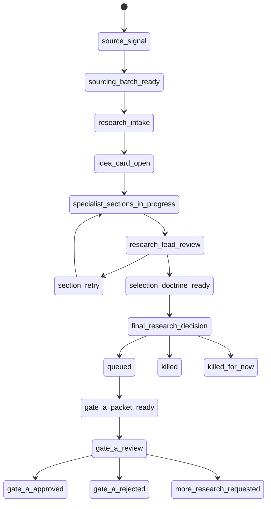
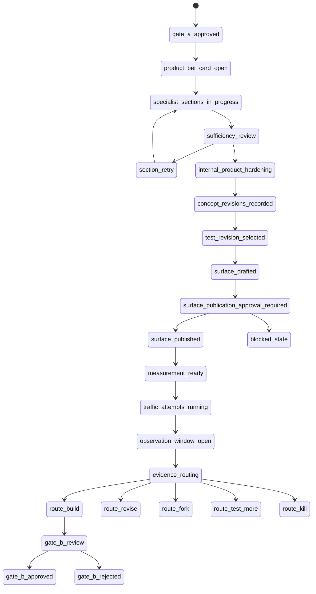
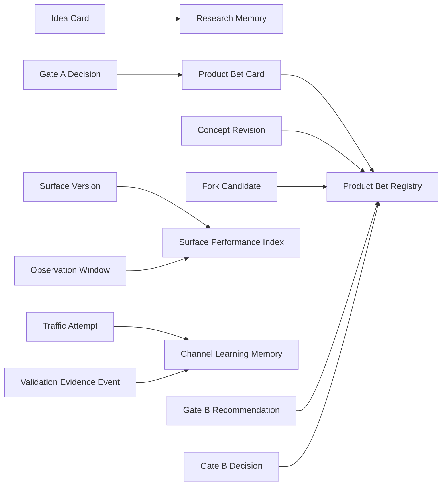

# NoHum Operating Ontology

Search keys: `ONT-00`, `ONT-01`, `ONT-02`, `ONT-03`, `ONT-04`,
`ONT-05`, `ONT-06`, `ONT-07`, `ONT-08`, `ONT-09`, `ONT-10`,
`ONT-11`, `ONT-12`, `ONT-13`.

This document defines the shared runtime language for NoHum Studio.

It exists to prevent agents from mixing stages, sources of truth, approvals,
recommendations, templates, and runtime work. A task title is never enough to
define work. Runtime meaning comes from:

```text
ontology type
-> current state
-> owner
-> source refs
-> allowed transition decisions
-> required evidence
```

## ONT-00 Core Doctrine

```text
Idea Card owns market truth.
Gate A opens Product Bet Validation, not build.
Product Bet owns product shape and validation after Gate A.
Landing is a measurement surface, not the product.
Organic traffic is an experiment engine, not a strategy memo.
Gate B owns build permission.
```

Gate A may authorize Product Bet Validation work. It does not authorize
product build, paid spend, payment collection, customer promises, support
operations, or uncontrolled public launch.

If a required Product Bet Validation step needs human approval, the correct
state is `approval_required` or `blocked_state`, not `gate_b_review`.

## ONT-01 System Layers

NoHum has five separate layers. Agents must name the layer they are reading or
mutating.

| Layer | Meaning | May create runtime work? | Source of truth rule |
|---|---|---:|---|
| `active_runtime` | live Paperclip issues, approvals, runs, knowledge, budgets, assignments | yes | current operational truth |
| `org_library` | imported agents, skills, docs, templates, doctrine | no, unless activated by a manager | reusable capability truth |
| `templates` | copyable task/artifact structures | no | pattern truth, not work |
| `archive` | retired or historical artifacts | no | history only, never active instruction |
| `future_design` | proposed architecture not yet activated | no | non-binding until accepted |

Runtime work must be created by managers from active artifacts. Importing the
org library must not import a backlog of Product Bet or Build tasks.

## ONT-02 System Definitions

| Type | Definition | Owner | Primary source of truth |
|---|---|---|---|
| `market_source_signal` | external signal that may produce venture candidates | Idea Scout | sourcing batch |
| `sourcing_batch` | bounded list of raw candidate leads | Idea Scout | batch artifact |
| `idea_card` | canonical pre-Gate-A market truth for one candidate | Research Lead | canonical Idea Card |
| `specialist_section` | owned section inside a canonical card | assigned specialist | same canonical card |
| `selection_doctrine` | decision-grade synthesis inside an Idea Card | Research Lead | Idea Card section |
| `gate_a_packet` | package asking whether to open Product Bet Validation | Research Lead | queue package |
| `gate_a_decision` | CEO/board decision on product-bet authorization | CEO / Board | approval/decision record |
| `product_bet_card` | canonical post-Gate-A product-shape truth | Launch Lead | Product Bet Card |
| `concept_revision` | controlled change to the current product bet | Pre-market Autoreasoner / Launch Lead | revision artifact |
| `fork_candidate` | viable alternate direction, not replacement of current bet | Pre-market Autoreasoner | fork artifact |
| `internal_product_hardening` | AI-led critique before market exposure | Pre-market Autoreasoner | autoreason report |
| `surface_version` | versioned landing/waitlist measurement surface | Landing Surface Builder | surface artifact |
| `traffic_attempt` | operational organic attempt to attract relevant traffic | Organic Traffic Strategist | traffic artifact |
| `observation_window` | bounded period for behavior measurement | Measurement Specialist | observation artifact |
| `validation_evidence_event` | normalized behavioral or blocked-state signal | Evidence Router | evidence event |
| `gate_b_recommendation` | evidence-based route: build/revise/fork/test_more/kill | Evidence Router | Gate B packet |
| `gate_b_decision` | human decision on build permission | CEO / Board | approval/decision record |
| `build_scope` | approved implementation boundary after Gate B | Launch Lead / Build owner | build brief |
| `derived_memory` | read-optimized projection from canonical artifacts | owning manager | never overrides canonical artifacts |

Alias rule:

- `ai_hardening` means `internal_product_hardening`.
- Do not use `ai_hardening` to mean market proof.
- Synthetic audience or autoreason output is hardening evidence only, never
  market validation.

## ONT-03 Runtime Object Contract

Every active runtime object that represents work or evidence should be
interpretable with this contract:

```yaml
runtime_object:
  ontology_type:
  current_state:
  owner:
  source_refs:
  required_inputs:
  allowed_decisions:
  blocked_by:
  required_outputs:
  next_owner:
```

Invalid runtime object patterns:

- correct title with wrong ontology type
- Gate B request without `gate_b_recommendation`
- Product Bet sprint that forbids required Product Bet states
- rewritten Idea Card after Gate A instead of `concept_revision`
- imported template treated as active backlog work
- archive artifact used as active instruction

## ONT-04 Research State Machine

Research is the only pre-Gate-A market-proof graph.



| State | Owner | Required artifact | Allowed next decisions |
|---|---|---|---|
| `source_signal` | Idea Scout | raw market/source signal | `source_batch` |
| `sourcing_batch_ready` | Idea Scout | sourcing batch | `select_for_intake`, `discard_batch` |
| `research_intake` | Research Lead | intake notes | `open_idea_card`, `reject_intake`, `hold_intake` |
| `idea_card_open` | Research Lead | canonical Idea Card | `assign_specialist_sections` |
| `specialist_sections_in_progress` | specialists | card sections | `submit_section` |
| `research_lead_review` | Research Lead | section updates | `pass_section`, `retry_section`, `escalate_section` |
| `section_retry` | exact section owner | retry request | `resubmit_section` |
| `selection_doctrine_ready` | Research Lead | doctrine section | `queue`, `kill`, `kill_for_now` |
| `gate_a_packet_ready` | Research Lead | Gate A packet | `request_gate_a_decision` |
| `gate_a_review` | CEO / Board | approval request | `approve_gate_a`, `reject_gate_a`, `request_more_research` |

Research final decisions:

| Decision | Meaning |
|---|---|
| `QUEUE` | strong enough to request Gate A |
| `KILL` | fails doctrine; do not continue |
| `KILL_FOR_NOW` | parked with explicit refresh condition |

## ONT-05 Product Bet State Machine

Product Bet Validation is the post-Gate-A, pre-build graph. It validates
product shape and market behavior before Gate B.



| State | Owner | Required artifact | Invalid shortcut |
|---|---|---|---|
| `gate_a_approved` | CEO / Board | Gate A decision | starting build |
| `product_bet_card_open` | Launch Lead | Product Bet Card | Gate B review |
| `specialist_sections_in_progress` | Product Bet specialists | owned sections/packs | loose notes only |
| `sufficiency_review` | Launch Lead | PASS/RETRY/ESCALATE per section | generic retry to manager |
| `internal_product_hardening` | Pre-market Autoreasoner | autoreason report | treating AI critique as market proof |
| `test_revision_selected` | Launch Lead | selected revision ref | surface work without revision ref |
| `surface_drafted` | Landing Surface Builder | landing/waitlist draft | calling draft a product |
| `surface_publication_approval_required` | Launch Lead / CEO | approval request | skipping to Gate B |
| `surface_published` | approved operator | surface version | spend or claims outside approval |
| `measurement_ready` | Measurement Specialist | measurement plan + QA | traffic without events |
| `traffic_attempts_running` | Organic Traffic Strategist | traffic attempt records | strategy memo with no attempt |
| `observation_window_open` | Measurement Specialist | observation window | deciding too early |
| `evidence_routing` | Evidence Router | evidence events | build recommendation without evidence |
| `gate_b_review` | CEO / Board | Gate B recommendation | approval without Evidence Router |

If public validation is not approved, the correct outcome is
`surface_publication_approval_required` or `blocked_state`. It is not
`gate_b_review`.

## ONT-06 Transition Decisions

### Research Decisions

| Decision | From | To | Owner | Required evidence |
|---|---|---|---|---|
| `source_batch` | `source_signal` | `sourcing_batch_ready` | Idea Scout | source refs |
| `select_for_intake` | `sourcing_batch_ready` | `research_intake` | Research Lead | shortlisted row |
| `open_idea_card` | `research_intake` | `idea_card_open` | Research Lead | preserved raw data |
| `assign_specialist_sections` | `idea_card_open` | `specialist_sections_in_progress` | Research Lead | card section ownership |
| `retry_section` | `research_lead_review` | `section_retry` | Research Lead | exact weak section |
| `queue` | `selection_doctrine_ready` | `queued` | Research Lead | doctrine pass enough for Gate A |
| `kill` | `selection_doctrine_ready` | `killed` | Research Lead | explicit failure reason |
| `kill_for_now` | `selection_doctrine_ready` | `killed_for_now` | Research Lead | refresh condition |
| `approve_gate_a` | `gate_a_review` | `gate_a_approved` | CEO / Board | Gate A packet |

### Product Bet Decisions

| Decision | From | To | Owner | Required evidence |
|---|---|---|---|---|
| `open_product_bet_validation` | `gate_a_approved` | `product_bet_card_open` | CEO creates, Launch Lead owns | Gate A decision |
| `assign_product_bet_sections` | `product_bet_card_open` | `specialist_sections_in_progress` | Launch Lead | Product Bet Card |
| `retry_product_bet_section` | `sufficiency_review` | `section_retry` | Launch Lead | exact weak section |
| `record_concept_revision` | `internal_product_hardening` | `concept_revisions_recorded` | Pre-market Autoreasoner | revision artifact |
| `record_fork_candidate` | `internal_product_hardening` | `concept_revisions_recorded` | Pre-market Autoreasoner | fork artifact |
| `select_test_revision` | `concept_revisions_recorded` | `test_revision_selected` | Launch Lead | revision ledger |
| `request_surface_publication_approval` | `surface_drafted` | `surface_publication_approval_required` | Launch Lead | surface version |
| `approve_surface_publication` | `surface_publication_approval_required` | `surface_published` | CEO / Board | approval |
| `start_observation_window` | `traffic_attempts_running` | `observation_window_open` | Measurement Specialist | traffic + measurement refs |
| `route_validation_evidence` | `observation_window_open` | `evidence_routing` | Evidence Router | evidence events |
| `recommend_build` | `evidence_routing` | `gate_b_review` | Evidence Router | Gate B hard criteria |
| `approve_gate_b` | `gate_b_review` | `gate_b_approved` | CEO / Board | Gate B recommendation |

## ONT-07 Gate Authority

| Gate | Opens | Does not open | Decision owner |
|---|---|---|---|
| Gate A | Product Bet Validation | build, paid spend, payment collection, customer promises | CEO / Board |
| Surface publication approval | public validation surface and approved traffic attempts | build, payment collection, broad GTM | CEO / Board |
| Gate B | scoped build | unlimited launch, scale marketing, payment claims outside scope | CEO / Board |

Gate A can allow internal Product Bet work without allowing public validation.
When public validation is blocked, the Product Bet loop must record the blocker
instead of pretending Gate B is ready.

## ONT-08 Agent Ownership Matrix

| Agent | Owns | Cannot approve |
|---|---|---|
| `ceo` | gates, priorities, approvals, manager tasks | specialist evidence quality alone |
| `research-lead` | Idea Card, research review, queue recommendation | Gate A |
| `idea-scout` | sourcing batches | queue decision |
| `competitor-scout` | competition section | final research verdict |
| `demand-validator` | demand section | final research verdict |
| `revenue-validator` | monetization section | final research verdict |
| `launch-lead` | Product Bet Card, sprint orchestration, sufficiency review | Gate B approval |
| `product-bet-compiler` | product identity, workflow, validation risks | Gate B |
| `competitor-deep-dive-analyst` | product-grade competitor teardown | Gate B |
| `economics-modeler` | unit economics and scenarios | spend approval |
| `offer-positioning-strategist` | offer, USP, pricing frame | public claims beyond approval |
| `organic-traffic-strategist` | organic traffic attempts and source report | paid spend |
| `pre-market-autoreasoner` | internal hardening, revisions, forks | market proof |
| `landing-surface-builder` | surface draft/version/QA | public publication approval |
| `product-bet-measurement-specialist` | measurement plan and observation window | build recommendation alone |
| `evidence-router` | evidence events and validation route | Gate B approval |

## ONT-09 Contract Conflict Rules

Agents must stop and report `CONTRACT_CONFLICT` when runtime instructions
contradict the ontology.

| Conflict | Required response |
|---|---|
| Product Bet task forbids landing/waitlist, traffic, observation, or evidence | block or request approval; do not request Gate B |
| Gate B approval requested without Evidence Router recommendation | reject/return as incomplete |
| Idea Card edited after Gate A | move changes into `concept_revision` |
| alternate direction replaces current bet silently | record `fork_candidate` |
| Research task asks for Product Bet/build work | reroute to CEO/Launch Lead |
| Product Bet uses old RAT/outreach/checkout/concierge layer | reject as archive/invalid surface |
| imported template appears as live backlog task | move to templates/org library, not active runtime |
| derived memory conflicts with canonical card | canonical artifact wins |

Prohibited active Product Bet surface:

- `rat-designer`
- `rat-plan`
- generic RAT layer
- checkout-intent validation
- concierge test default
- cold outreach default
- paid ads default
- `market-signal-scout`
- `market-proof-analyst`
- broad post-build Marketing skills as pre-Gate-B kernel

## ONT-10 Evidence And Memory

Canonical artifacts own truth. Memory only indexes truth.



Memory rules:

- Memory may summarize, index, and retrieve.
- Memory may not create new market facts.
- Memory may not override Idea Card, Product Bet Card, Gate decisions, or
  Evidence Router recommendation.
- Cost, source quality, freshness, and confidence should be recorded on
  evidence-bearing artifacts.

## ONT-11 Import And Runtime Rules

| Importable | Active on import? | Activation path |
|---|---:|---|
| agents | no | manager assigns runtime task |
| skills | no | agent uses skill during task |
| docs | no | referenced by runtime work |
| templates | no | copied into task/artifact by manager |
| archive docs | no | never active instruction |
| Research bootstrap tasks | yes, if explicitly seeded | CEO/Research Lead |
| Product Bet runtime tasks | no | only after Gate A |
| Build runtime tasks | no | only after Gate B |

Future imports should fail or warn if dormant Product Bet templates become
active backlog tasks.

## ONT-12 Runtime Audit Checklist

Use this checklist when reviewing live Paperclip company state.

Research:

- one canonical Idea Card per selected idea
- specialist sections are inside or linked from that card
- Research Lead review uses `PASS | RETRY | ESCALATE`
- final decision is `QUEUE | KILL | KILL_FOR_NOW`
- Gate A packet cites the Idea Card

Product Bet:

- Gate A decision exists before sprint
- CEO created exactly one Product Bet Validation Sprint
- Launch Lead opened Product Bet Card
- specialist tasks or owned sections exist
- internal hardening produced revisions/forks
- one test revision was selected
- surface version exists or approval blocker exists
- measurement plan exists before traffic
- traffic attempts exist or blocked states are explicit
- observation window exists before evidence route
- Evidence Router wrote recommendation before Gate B approval

Immediate red flags:

- `gate_b_review` before surface/traffic/observation/evidence
- Product Bet task described as definition-only package
- public validation forbidden with no approval/blocker state
- Launch Lead asks for Gate B without Evidence Router
- old RAT assets active in Product Bet

## ONT-13 Search Terms And Aliases

Preferred terms:

- `internal_product_hardening`, not vague `ai_hardening`
- `surface_version`, not generic landing page
- `traffic_attempt`, not GTM strategy memo
- `validation_evidence_event`, not generic signal
- `blocked_state`, not hidden missing work
- `gate_b_recommendation`, not build approval

Allowed aliases:

| Alias | Canonical term |
|---|---|
| `ai_hardening` | `internal_product_hardening` |
| `landing` | `surface_version` when used for validation |
| `waitlist page` | `surface_version` |
| `organic loop` | `traffic_attempt` + `observation_window` |
| `market proof` before Gate A | `Idea Card` evidence |
| `market proof` after Gate A | behavioral `validation_evidence_event` |

Do not use the word `ready` without naming the target state:

- `ready_for_gate_a`
- `ready_for_surface_publication_approval`
- `ready_for_observation`
- `ready_for_evidence_routing`
- `ready_for_gate_b_review`

`ready_for_gate_b_review` is invalid without Evidence Router recommendation or
explicit CEO/board accepted-risk override.
