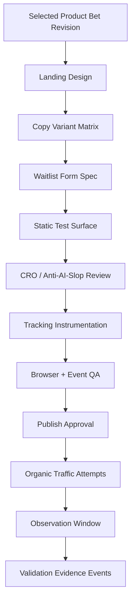

# Product Bet Validation Playbook

Trigger: CEO records Gate A approval with
`action: approve_product_bet_definition`.

Primary owner: `Launch Lead`

## Operating Rule

Product Bet Validation is a post-Gate-A product-shaping and validation
machine.

It does not replace Research, does not approve build, and does not start before
Gate A.

Research pattern is reused:

```text
one canonical card
-> specialist-owned sections
-> manager sufficiency review
-> versioned revisions and forks
-> landing/waitlist surface
-> organic traffic attempts
-> observation window
-> gate recommendation
```

## Runtime Sequence

1. CEO records `gate_a_decision`.
2. CEO creates exactly one runtime task: `Run Product Bet Validation Sprint`.
3. Launch Lead opens exactly one Product Bet Card.
4. Launch Lead creates specialist assignments only after the card exists.
5. Specialists write owned Product Bet Card sections and linked packs.
6. Pre-Market Autoreasoner records revisions and forks.
7. Launch Lead selects the revision to test externally.
8. Landing Surface Builder creates the landing/waitlist surface.
9. Product Bet Measurement Specialist verifies tracking and observation policy.
10. Organic Traffic Strategist runs approved organic traffic attempts.
11. Evidence Router writes validation evidence events and validation decision.
12. Evidence Router writes Gate B Recommendation only when build is warranted.
13. CEO/board records Gate B Decision.

Do not import a batch of specialist tasks as immediate backlog items.

## Inputs

- frozen Idea Card
- Gate A decision and constraints
- current Copyable Product Thesis
- Gate B policy
- payment-signal policy
- canonical stack policy
- Product Bet templates under `docs/templates/product-bets/`

## Gate A Decision Fields

| Field | Meaning | Source | Final owner |
|---|---|---|---|
| `action` | разрешить Product Bet Validation или вернуть назад | Research recommendation | CEO |
| `idea_card_ref` | frozen Idea Card | Research Lead | CEO records |
| `research_case_id` | ID research case | Research Lead | CEO records |
| `market` | какой рынок прошел Gate A | Research | CEO fixes |
| `buyer_segment` | какой сегмент разрешено прорабатывать | Research | CEO may narrow |
| `competitor_pattern` | какой рыночный паттерн берем | Competitor section | CEO fixes |
| `product_category` | категория продукта | Research | CEO fixes |
| `max_definition_time` | timebox до Gate B recommendation | CEO | CEO |
| `max_test_budget_cents` | бюджет тестов до Gate B | CEO | CEO |
| `allowed_external_actions` | landing, directory, public posts, pricing CTA, etc. | Launch Lead may propose later | CEO approves |
| `forbidden_claims` | что нельзя обещать | Research risks | CEO fixes |
| `legal_platform_risks` | ToS/platform/legal boundaries | Research | CEO fixes |
| `stack_constraints` | canonical stack / exception needed | Operating Spec | CEO fixes |
| `next_owner` | кто ведет дальше | fixed | CEO |

Research gathers evidence and proposes a Gate A recommendation. CEO turns it
into a management contract.

## Specialist Work Blocks

| Step | Owner | Writes | Sufficiency question |
|---|---|---|---|
| Open card | `launch-lead` | Gate A context | Are refs and constraints frozen? |
| Product shape | `product-bet-compiler` | identity, audience, workflow | Is the product concrete enough to critique? |
| Competitors | `competitor-deep-dive-analyst` | competitor deep dive pack | Do we understand product/pricing/onboarding/distribution gaps? |
| Offer | `offer-positioning-strategist` | offer brief | Is the offer specific, believable, and claims-safe? |
| Economics | `economics-modeler` | financial model | Do scenarios show break-even and `$5k` paths? |
| Organic distribution | `organic-traffic-strategist` | pain language, search/community maps, traffic attempts | Can we get relevant free traffic? |
| Autoreason | `pre-market-autoreasoner` | autoreason report, revisions, forks | Did internal critique improve or kill the bet? |
| Validation risks | `product-bet-compiler` | validation risk map | Are killer risks mapped and testable? |
| Test surfaces | `landing-surface-builder` | landing design, waitlist form, surface version, QA | Can the landing measure positioning and signup intent? |
| Measurement | `product-bet-measurement-specialist` | measurement plan, observation window | Can test signals be observed and reviewed at the right time? |
| Evidence | `evidence-router` | validation evidence events, validation decision | Are findings normalized and routed to the right next action? |
| Gate B routing | `evidence-router` | Gate B recommendation | Is build/revise/test_more/kill justified? |

## Competitor Deep Dive

Competitor Deep Dive is post-Gate-A and deeper than Research competitor proof.

Required capture:

- homepage promise and CTA
- pricing/plans/trial/free tier
- signup/onboarding path when allowed
- first value moment
- workflow inputs and outputs
- trust proof
- SEO pages, comparison pages, directories, communities
- weaknesses and friction
- copyable and non-copyable patterns
- differentiation gap

Default tool is browser/Playwright. Obscura-style browser automation is
experimental and requires smoke test before use.

## Economics

Economics Modeler must produce conservative, base, and aggressive scenarios.

Required outputs:

- monthly price and plan shape
- funnel assumptions
- fixed and variable costs
- AI/API cost per active user
- support minutes per paid user
- gross margin and contribution margin
- break-even month and users
- month to `$5k MRR`
- month to `$5k net contribution`
- sensitivity and kill thresholds

No fake precision. Label every number as observed, inferred, or assumed.

## AI Hardening And Forking

Before external traffic, the Product Bet is hardened internally.

Required flow:

1. freeze Idea Card, Gate A decision, competitor/economics/offer context
2. critique buyer, pain, payment, channel, activation, trust, legal safety
3. generate bounded variants
4. run synthetic audience review when useful
5. create `concept_revision` records for meaningful changes
6. create `fork_candidate` records for alternate directions
7. select exactly one `selected_test_revision`

Synthetic audience output is product-shaping evidence, not market validation.

## Offer And Validation Surface

Pre-Gate-B test GTM is not the full Marketing org. It is a validation cell.

It must produce:

- offer brief
- selected test revision
- landing design
- copy variant matrix
- waitlist form spec
- organic traffic strategy
- landing and comparison surface pack
- pricing intent surface
- surface version and browser QA
- directory/community/public post drafts when allowed
- measurement plan
- claims review
- validation evidence events

The full Marketing org inherits winning angles and channel notes after Gate B or
build approval.

## Autoreason / Synthetic Audience

Autoreason is an internal product-shaping loop, not market validation.

Default config:

```yaml
max_rounds: 2
avatars: 6
variants_per_round: 3
judges: 3
external_actions_allowed: false
```

Required outputs:

- objection map
- unclear claims
- strongest and weakest variants
- recommended concept revision
- fork candidates
- validation risks added
- judge disagreement

Every meaningful change is a `concept_revision`. Every alternate direction is a
`fork_candidate`.

## Landing + Traffic + Analytics Workflow



Only validation actions allowed by the Gate A constraints and linked approvals
can run.

## Organic Distribution Loop

Organic work is not a strategy memo. It is a loop that tries to earn enough
relevant free traffic for a decision.

Required outputs:

- pain language map
- search intent map
- community prospecting map
- thread scorecards
- free value wedge
- organic distribution test plan
- traffic attempts
- traffic source report

Default channel order:

1. problem/category search intent
2. competitor-alternative pages and comparisons
3. Reddit/HN/IndieHackers/niche community threads
4. directories and marketplaces
5. free tool, template, calculator, checker, or demo output
6. approved X/build-in-public or founder-story surfaces

If traffic is insufficient, retry routes to the organic owner. If traffic is
sufficient but conversion is weak, retry routes to offer or landing depending
on the evidence.

## Observation Window

Default window:

```yaml
min_runtime_hours: 72
max_runtime_days: 14
min_unique_visitors: 300
preferred_unique_visitors: 1000
min_channel_count: 2
```

Default signal bands:

```yaml
waitlist_submits:
  weak: 10
  promising: 30
  strong: 50
CTA_click_rate:
  weak: 1%
  promising: 3%
  strong: 5%
waitlist_conversion:
  weak: 1%
  promising: 3%
  strong: 5%
```

Interpretation:

- not enough time -> keep waiting
- not enough traffic -> run more organic attempts
- enough traffic but weak CTA/waitlist -> revise offer, landing, or channel
- qualified waitlist signal -> build recommendation may be written
- contradictory response -> fork or test more
- no signal by max window -> kill or park

## Allowed Gate B Recommendations

- `build`
- `revise`
- `fork`
- `test_more`
- `kill`

The recommendation is not Gate B approval. Gate B remains a board boundary.

## Required Outputs

- Product Bet Card
- competitor deep dive pack
- financial model
- offer brief
- organic traffic strategy
- pain language, search intent, and community prospecting maps
- concept revisions and fork candidates
- selected test revision
- landing design
- copy variant matrix
- waitlist form spec
- validation risk map
- validation plans
- autoreason report
- test GTM surface pack
- surface version and QA
- measurement plan
- observation window
- traffic attempts and traffic source report
- validation evidence events
- validation cycle report
- Gate B recommendation
- validation learning report

## Failure Modes

Escalate when:

- Gate A decision is missing
- Idea Card is being rewritten after Gate A
- evidence lacks source references
- thresholds are missing
- a decision tries to bypass Gate B
- the sprint needs external spend without an approved budget envelope
- a payment signal is ambiguous
- a source has ToS or commercial-use risk
- no plausible free traffic path exists
- observation window lacks enough time or traffic
- landing/waitlist surface has no valid tracking
- the product requires non-canonical stack changes

## Acceptance Criteria

- Product Bet Validation starts only from a Gate A approved Idea Card.
- Every specialist wrote an owned Product Bet Card section.
- Every detailed pack is linked from the card.
- A selected test revision exists.
- Landing/waitlist surface exists as a versioned measurement surface.
- Organic distribution attempts exist or blocked states are explicit.
- Observation window is complete or the decision is `test_more`.
- Every validation risk has a risk class and test method.
- Every validation surface or organic traffic attempt has success and failure
  thresholds.
- Every validation evidence event has source refs and limitations.
- Gate B recommendation is one of `build`, `revise`, `test_more`, or `kill`.
- No build, product repo attach, or action outside Gate A constraints happens
  without the required approval.
