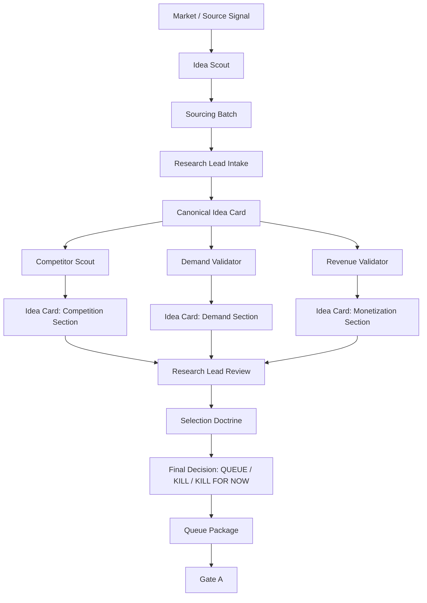
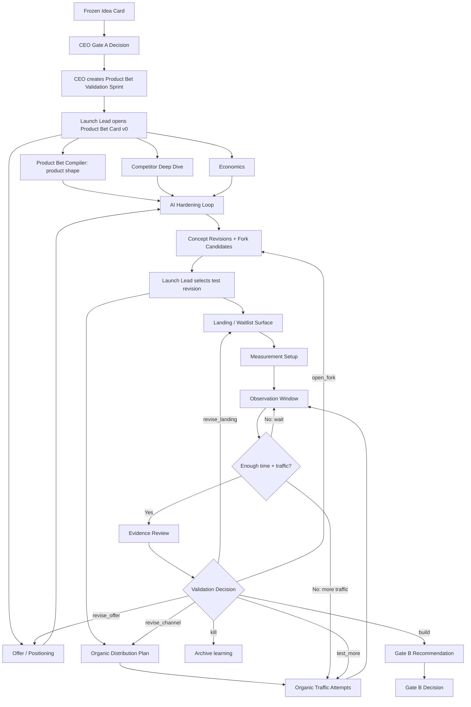

# Research And Product Bet Automation Map

NoHum has two separate automation graphs.

Research is the only pre-Gate-A market-proof graph.

Product Bet Validation is the post-Gate-A product-shaping, traffic, observation,
and Gate-B-readiness graph.

The Product Bet graph is imported as dormant org structure. It is not active
runtime work until CEO records Gate A and creates the Product Bet Validation
Sprint.

## Graph 1: Research / Gate A



Research agents:

- `idea-scout`
- `research-lead`
- `competitor-scout`
- `demand-validator`
- `revenue-validator`

## Graph 2: Product Bet Validation / Gate B



## Product Bet Specialist Sections

| Section | Owner | Detailed artifact |
|---|---|---|
| Gate A context | `launch-lead` | Gate A decision |
| Product identity / audience / workflow | `product-bet-compiler` | Product Bet Card |
| Competitor deep dive | `competitor-deep-dive-analyst` | Competitor Deep Dive Pack |
| Offer / positioning | `offer-positioning-strategist` | Offer Brief |
| Economics | `economics-modeler` | Financial Model |
| Organic distribution | `organic-traffic-strategist` | Pain Language Map, Search Intent Map, Community Prospecting Map, Organic Distribution Test Plan |
| Autoreason | `pre-market-autoreasoner` | Autoreason Report |
| Validation risks | `product-bet-compiler` | Validation Risk Map and Test Plans |
| Test surfaces | `landing-surface-builder` | Landing Design, Waitlist Form Spec, Test GTM Surface Pack, Surface QA |
| Measurement and observation | `product-bet-measurement-specialist` | Measurement Plan, Observation Window |
| Traffic evidence | `organic-traffic-strategist` + `evidence-router` | Traffic Attempts, Traffic Source Report, Validation Evidence Events |
| Gate B recommendation | `evidence-router` | Gate B Recommendation |

## Activation Rule

The root package imports Product Bet agents, skills, docs, and templates. It
does not import runtime specialist tasks.

Runtime sequence:

```text
CEO creates one Product Bet Validation Sprint
-> Launch Lead opens Product Bet Card
-> Launch Lead creates specialist assignments
-> specialists update card sections
-> AI hardening records revisions and forks
-> Launch Lead selects a test revision
-> Landing Surface Builder creates the waitlist surface
-> Product Bet Measurement Specialist verifies events and observation window
-> Organic Distribution Operator runs approved traffic attempts
-> Evidence Router writes validation decision and Gate B recommendation when warranted
```

## Retry Routing

Retry never returns to `Launch Lead` as generic work. Launch Lead routes retry
to the exact owner of the weak surface.

| Weak signal | Retry owner | Expected fix |
|---|---|---|
| buyer or product shape unclear | `product-bet-compiler` | concept revision |
| offer unclear or unbelievable | `offer-positioning-strategist` | revised offer brief |
| landing clarity/friction weak | `landing-surface-builder` | revised surface version |
| traffic quantity weak | `organic-traffic-strategist` | new traffic attempt |
| traffic quality weak | `organic-traffic-strategist` | channel/funnel revision |
| instrumentation broken | `product-bet-measurement-specialist` | measurement QA fix |
| evidence ambiguous | `evidence-router` | corrected validation evidence event |
| alternate angle looks stronger | `pre-market-autoreasoner` | fork candidate or promoted revision |

## Marketing Relationship

Pre-Gate-B validation uses a small test-GTM cell:

- `organic-traffic-strategist`
- `offer-positioning-strategist`
- `landing-surface-builder`
- `product-bet-measurement-specialist`

The full Marketing org (`CMO`, `Growth Lead`, SEO, paid media, content,
community, support feedback loops) remains post-build or scale-layer work. It
inherits winning angles, losing angles, channel notes, and content seeds from
the Product Bet Card.

## Human Boundaries

Humans remain responsible for:

- Gate A approval
- Gate B approval
- secrets and account access
- approval for public validation surface publication
- approval for any action outside Gate A constraints
- override

Agents must record blocked states instead of asking humans to fill templates
manually.
