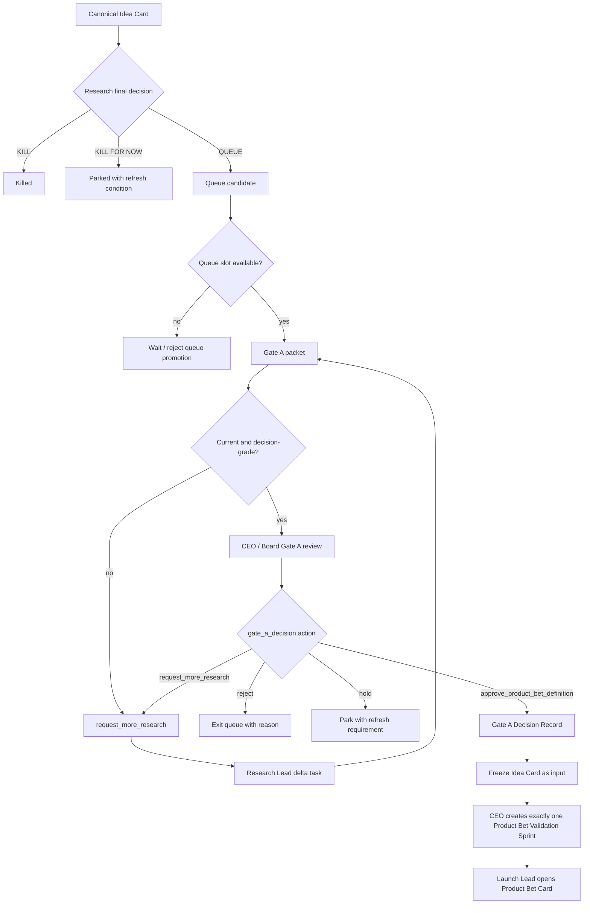

# Gate A Mini-Passport

Gate A is the governance boundary between Research and Product Bet Validation.

It is a decision gate, not a production module. It exists to prevent three
different things from being collapsed:

```text
Research final decision: QUEUE
-> Gate A packet readiness
-> CEO/Board Gate A decision
-> Product Bet Validation Sprint activation
```

Use [Module Documentation Standard](../atlas/module-documentation-standard.md)
for the passport format.

## Purpose

Gate A decides whether one queued research candidate may enter Product Bet
Validation.

Gate A opens product definition and validation. It does not open build, public
launch, paid spend, payment collection, customer promises, or broad GTM.

## Boundary

Gate A owns:

- queue-slot governance
- final check that the research package is current and canonical
- management constraints for Product Bet Validation
- decision record that freezes the Research input for post-Gate-A work
- one activation path into one `Run Product Bet Validation Sprint`

Gate A must not:

- create Product Bet work before the decision is recorded
- treat `QUEUE` as approval
- let Research rewrite the `Idea Card` after approval
- authorize build or repo attachment
- authorize public validation unless the decision explicitly allows or later
  approval grants it
- create multiple Product Bet sprints for the same Gate A decision

## Activation

Gate A activates only when:

```text
Research Lead final decision = QUEUE
-> queue slot is available
-> canonical Idea Card is current
-> Gate A packet is prepared
-> CEO/Board reviews the packet
```

If any precondition is missing, the correct route is back to Research Lead, not
forward to Launch Lead.

## Doctrine

```text
Idea Card owns market truth.
QUEUE recommends Gate A review.
Gate A opens Product Bet Validation, not build.
Product Bet owns product shape only after Gate A.
Gate B owns build permission.
```

## Process Map



## Objects

| Object | Type | Owner | Source-of-truth rule |
|---|---|---|---|
| `idea_card` | immutable input after approval | Research Lead before Gate A, frozen after Gate A | owns pre-Gate-A market truth |
| `final_research_decision` | research decision | Research Lead | `QUEUE`, `KILL`, or `KILL FOR NOW` |
| `queue_candidate` | active queue object | Research Lead / CEO | at most one queued candidate |
| `gate_a_packet` | review packet | Research Lead | cites canonical `Idea Card` |
| `gate_a_decision` | approval/decision record | CEO / Board | only object that can open Product Bet Validation |
| `product_bet_validation_sprint` | post-Gate-A runtime task | CEO creates, Launch Lead owns | exactly one sprint per approved Gate A decision |

Invalid substitutes:

- a `QUEUE` verdict treated as Gate A approval
- a comment saying "approved" without a `gate_a_decision` record
- Product Bet Card opened from research notes without frozen `idea_card_ref`
- multiple Product Bet sprints for the same candidate
- build tasks created from Gate A instead of Gate B

## States

| State | Owner | Required artifact | Allowed next decisions |
|---|---|---|---|
| `queued` | Research Lead | final research decision `QUEUE` | `prepare_gate_a_packet`, `hold`, `refresh_research` |
| `gate_a_packet_ready` | Research Lead | Gate A packet | `request_gate_a_decision` |
| `gate_a_review` | CEO / Board | approval request | `approve_product_bet_definition`, `reject`, `hold`, `request_more_research` |
| `gate_a_approved` | CEO / Board | `gate_a_decision` | `create_product_bet_validation_sprint` |
| `gate_a_rejected` | CEO / Board | rejection reason | `exit_queue` |
| `more_research_requested` | Research Lead | research delta task | `update_gate_a_packet` |
| `gate_a_hold` | CEO / Board | refresh condition | `revisit` or `expire` |

## Decisions

| Decision | From | To | Owner | Required evidence |
|---|---|---|---|---|
| `prepare_gate_a_packet` | `queued` | `gate_a_packet_ready` | Research Lead | canonical Idea Card, Selection Doctrine, final decision |
| `request_gate_a_decision` | `gate_a_packet_ready` | `gate_a_review` | Research Lead / CEO | complete Gate A packet |
| `approve_product_bet_definition` | `gate_a_review` | `gate_a_approved` | CEO / Board | management approval and constraints |
| `reject` | `gate_a_review` | `gate_a_rejected` | CEO / Board | rejection reason |
| `hold` | `gate_a_review` | `gate_a_hold` | CEO / Board | refresh requirement |
| `request_more_research` | `gate_a_review` | `more_research_requested` | CEO / Board | exact missing evidence or stale field |
| `create_product_bet_validation_sprint` | `gate_a_approved` | Product Bet runtime activation | CEO | `gate_a_decision` with `action: approve_product_bet_definition` |

## Decision Contract

Use [Gate A Decision Template](../templates/queue/gate-a-decision.md).

Canonical action names:

- `approve_product_bet_definition`
- `reject`
- `hold`
- `request_more_research`

Do not use `PASS`, `FAIL`, `RETRY`, or `ESCALATE` as Gate A decision values.
Those are review-quality words, not the canonical decision contract.

Required constraints in an approval:

```yaml
constraints:
  max_definition_time:
  max_test_budget_cents:
  allowed_external_actions:
  forbidden_external_actions:
  forbidden_claims:
  legal_platform_risks:
  stack_constraints:
```

If public validation, publication, traffic, or spend is not explicitly allowed,
Launch Lead must treat it as approval-required later.

## Agents

| Agent | Owns | Writes | Cannot approve |
|---|---|---|---|
| `research-lead` | queue quality and Gate A packet | `gate_a_packet`, research delta updates | Gate A approval, Product Bet sprint |
| `ceo` | allocation and decision recording | `gate_a_decision`, Product Bet sprint task after approval | board-only exceptions beyond policy |
| `launch-lead` | post-approval Product Bet Validation | Product Bet Card after CEO-created sprint | Gate A approval, build |
| `board` | governance override and approval boundary | approval/rejection/hold decision when required | specialist evidence quality alone |

## Tools And MCP

| Tool/source | User | Allowed use |
|---|---|---|
| Paperclip | CEO, Research Lead, Launch Lead | issue state, approval record, sprint activation |
| Paperclip Knowledge | CEO, Research Lead | Gate A packet and linked knowledge refs |
| Research artifacts | CEO / Board | decision review |
| Budget/secrets state | CEO / Board | set or confirm constraints, not expose secret values |

Gate A should not require build/deploy/payment tools.

## Memory

Canonical truth:

- `Idea Card` before approval
- `gate_a_decision` after approval

Derived memory:

- `Research Registry`
- `Decision Memory`
- `Eval Dataset Export`
- later Product Bet Registry references the `gate_a_decision`

Rule:

- after Gate A approval, the `Idea Card` is frozen as market-truth input
- any post-Gate-A idea change must become `concept_revision` or
  `fork_candidate` in Product Bet, not an edit to the `Idea Card`

## Outputs

Gate A produces exactly one of:

- `gate_a_decision.action: approve_product_bet_definition`
- `gate_a_decision.action: reject`
- `gate_a_decision.action: hold`
- `gate_a_decision.action: request_more_research`

If approved, the next runtime output is exactly one:

- `Run Product Bet Validation Sprint` assigned to `launch-lead`

## Failure Modes

| Failure | Correct response |
|---|---|
| `QUEUE` treated as approval | require `gate_a_decision` record |
| Gate A packet lacks canonical `idea_card_ref` | return to Research Lead |
| packet is stale or queue slot changed | `request_more_research` or refresh |
| approval lacks budget/external-action constraints | block Product Bet external actions until constraint is set |
| multiple Product Bet sprints for one Gate A decision | cancel/supersede duplicates and keep one canonical sprint |
| Product Bet edits the frozen `Idea Card` | move changes to `concept_revision` |
| build/repo task created from Gate A | `CONTRACT_CONFLICT`; build requires Gate B |
| public validation assumed allowed | require explicit surface publication approval |

Incident rule:

- `consequence_fix`: repair the active runtime state and route work back to the
  correct Gate A state.
- `cause_fix`: update source docs, agent instructions, task templates,
  validators, runtime sync, or evals so the confusion does not recur.

## Source Map

| Need | Source |
|---|---|
| module/gate documentation standard | [Module Documentation Standard](../atlas/module-documentation-standard.md) |
| factory module index | [Factory Module Map](../atlas/factory-module-map.md) |
| Research module passport | [Research Module](../research/README.md) |
| Gate A decision shape | [Gate A Decision Template](../templates/queue/gate-a-decision.md) |
| queue-to-venture transition | [Queue To Venture Machine](../automation/queue-to-venture-machine.md) |
| queue/Gate A playbook | [Queue And Gate A Playbook](../playbooks/queue-gate-a-playbook.md) |
| ontology states and decisions | [Operating Ontology](../ontology/nohum-operating-ontology.md) |
| venture lifecycle | [Venture Lifecycle](../atlas/venture-lifecycle.md) |
| Product Bet activation target | [Product Bet Validation Loop](../product-bets/README.md) |
