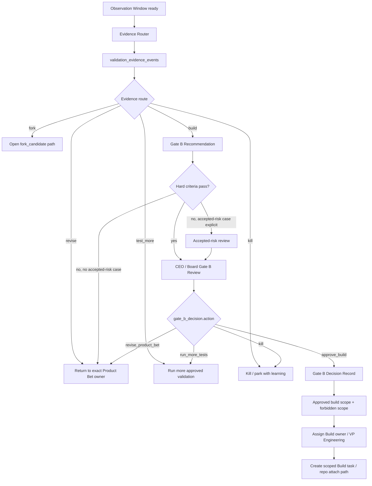

# Gate B Mini-Passport

Gate B is the governance boundary between Product Bet Validation and Build.

It is a decision gate, not an evidence report and not an engineering kickoff.
It exists to prevent three different things from being collapsed:

```text
Evidence Router route: build
-> Gate B recommendation packet
-> CEO/Board Gate B decision
-> scoped Build activation
```

Use [Module Documentation Standard](../atlas/module-documentation-standard.md)
for the passport format.

## Purpose

Gate B decides whether one tested Product Bet revision may open a scoped build
lane.

Gate B opens scoped build only. It does not open unlimited launch, broad GTM,
payment promises outside scope, scale marketing, support operations, or
unbounded engineering autonomy.

## Boundary

Gate B owns:

- final approval boundary for build
- review of `gate_b_recommendation`
- accepted-risk decision when some hard criteria are unresolved
- approved build scope and forbidden scope
- build owner and next task
- repo/build activation only after approval

Gate B must not:

- treat Evidence Router recommendation as approval
- approve build without a `gate_b_decision` record
- approve a different product revision than the one tested
- reopen the frozen Idea Card
- authorize paid scaling, public launch, or payment promises outside the
  decision contract
- create multiple build lanes for one Gate B decision

## Activation

Gate B activates only when:

```text
Product Bet Validation completed required loops
-> Evidence Router writes gate_b_recommendation
-> recommendation.action = build, revise, fork, test_more, or kill
-> CEO/Board reviews the recommendation
```

If `gate_b_recommendation` does not exist, the correct route is back to
Evidence Router or the exact failed Product Bet loop, not forward to Build.

## Doctrine

```text
Product Bet owns product shape after Gate A.
Evidence Router may recommend a route.
Gate B owns build permission.
Gate B approval is scoped build permission, not unlimited launch.
```

## Process Map



## Objects

| Object | Type | Owner | Source-of-truth rule |
|---|---|---|---|
| `product_bet_card` | canonical post-Gate-A artifact | Launch Lead | owns product shape before Gate B |
| `product_bet_revision_ref` | tested revision identity | Launch Lead | Gate B reviews only the tested revision |
| `surface_version_ref` | tested validation surface | Landing Surface Builder / Measurement Specialist | evidence must cite exact surface |
| `observation_window` | readiness artifact | Product Bet Measurement Specialist | proves time/traffic/source-quality maturity |
| `validation_evidence_event` | normalized evidence | Evidence Router | source-linked behavior or blocked state |
| `gate_b_recommendation` | recommendation packet | Evidence Router | input to Gate B, not approval |
| `accepted_risk` | explicit governance exception | CEO / Board | must cite unresolved hard criterion |
| `gate_b_decision` | approval/decision record | CEO / Board | only object that can open scoped build |
| `build_scope` | downstream boundary | CEO / Board, then Build owner | implementation scope after approval |

Invalid substitutes:

- Evidence Router saying `build` without `gate_b_recommendation`
- `gate_b_recommendation` treated as approval
- a comment saying "approved" without `gate_b_decision`
- build/repo task created before Gate B decision
- build scope that does not match `product_bet_revision_ref`
- accepted risk with no named hard criterion and owner

## States

| State | Owner | Required artifact | Allowed next decisions |
|---|---|---|---|
| `observation_ready_for_review` | Measurement Specialist | observation window | `route_validation_evidence` |
| `evidence_routing` | Evidence Router | evidence events | `recommend_build`, `route_revise`, `route_fork`, `route_test_more`, `route_kill` |
| `gate_b_recommendation_ready` | Evidence Router | Gate B recommendation | `request_gate_b_decision` |
| `gate_b_review` | CEO / Board | recommendation packet | `approve_build`, `revise_product_bet`, `run_more_tests`, `kill` |
| `gate_b_approved` | CEO / Board | Gate B decision | `activate_scoped_build` |
| `gate_b_rejected_or_revised` | CEO / Board | decision reason | route to Product Bet loop |
| `build_activation_ready` | VP Engineering / Build owner | build scope and handoff | repo attach / implementation planning |

## Decisions

| Decision | From | To | Owner | Required evidence |
|---|---|---|---|---|
| `route_validation_evidence` | `observation_ready_for_review` | `evidence_routing` | Evidence Router | evidence events and observation refs |
| `recommend_build` | `evidence_routing` | `gate_b_recommendation_ready` | Evidence Router | Gate B hard criteria pass or accepted-risk case |
| `request_gate_b_decision` | `gate_b_recommendation_ready` | `gate_b_review` | Launch Lead / Evidence Router / CEO | Gate B recommendation |
| `approve_build` | `gate_b_review` | `gate_b_approved` | CEO / Board | decision contract and approved build scope |
| `revise_product_bet` | `gate_b_review` | Product Bet revision route | CEO / Board | exact weak axis |
| `run_more_tests` | `gate_b_review` | Product Bet test-more route | CEO / Board | missing evidence / insufficient confidence |
| `kill` | `gate_b_review` | killed/parked | CEO / Board | kill rationale and learning refs |
| `activate_scoped_build` | `gate_b_approved` | build runtime | CEO / VP Engineering | Gate B decision |

## Decision Contract

Use [Gate B Decision Template](../templates/product-bets/gate-b-decision.md).

Canonical action names:

- `approve_build`
- `revise_product_bet`
- `run_more_tests`
- `kill`

Do not use `PASS`, `FAIL`, `RETRY`, or `ESCALATE` as Gate B decision values.
Those are review-quality words, not the canonical decision contract.

Required approval fields:

```yaml
decision_contract:
  approved_build_scope:
  forbidden_scope:
  accepted_risks:
  unresolved_red_hypotheses:
  financial_model_ref:
  organic_traffic_ref:
  measurement_plan_ref:
  budget_cap:
  next_owner:
  next_task:
```

If the decision accepts risk, it must identify:

- hard criterion not fully satisfied
- reason build is still worth approving
- owner responsible for mitigation
- stop/rollback condition

## Hard Criteria

Gate B `approve_build` cannot be recorded unless every hard criterion passes or
CEO/board explicitly accepts the named risk in the Gate B decision.

Use the hard criteria in [Product Bet Validation Loop](../product-bets/README.md#gate-b-hard-criteria).

Minimum non-negotiable refs:

- frozen `Idea Card`
- Gate A decision
- tested `product_bet_revision_ref`
- selected test revision
- surface version and QA
- measurement plan and working analytics
- organic traffic attempts or explicit blocker/accepted risk
- observation window
- validation evidence events
- financial model and build scope
- claims/policy/stack fit

## Agents

| Agent | Owns | Writes | Cannot approve |
|---|---|---|---|
| `evidence-router` | evidence route and Gate B recommendation | validation evidence events, recommendation packet | Gate B approval |
| `launch-lead` | Product Bet sufficiency and handoff readiness | review notes, accepted-risk escalation, build handoff prep | Gate B approval |
| `ceo` | gate decision and build activation | `gate_b_decision`, scoped build task after approval | unsupported specialist evidence |
| `board` | governance approval and accepted-risk boundary | approval/rejection/accepted-risk decision | evidence fabrication or specialist QA |
| `vp-of-engineering` | build lane after approval | implementation plan / repo attach path | Gate B approval |

## Tools And MCP

| Tool/source | User | Allowed use |
|---|---|---|
| Paperclip | CEO, Launch Lead, Evidence Router, VP Engineering | issue state, approval record, build task activation |
| Paperclip Knowledge | CEO, Launch Lead, Evidence Router | recommendation packet and linked evidence |
| Analytics | Evidence Router / Measurement Specialist | read evidence only when instrumentation is QA-passed |
| Repo/GitHub | VP Engineering after approval | repo attach and implementation planning |
| Railway/Sentry/deploy tools | Build/SRE after approval | build/deploy preparation inside approved scope |

Gate B review itself should not require build/deploy/payment side effects.

## Memory

Canonical truth:

- `Product Bet Card`
- `gate_b_recommendation`
- `gate_b_decision`

Derived memory:

- `Product Bet Registry`
- `Surface Performance Index`
- `Channel Learning Memory`
- later build/release learning records

Rules:

- Product Bet memory may index Gate B outcome but cannot override the decision
- Build must cite the exact `gate_b_decision` and `product_bet_revision_ref`
- post-Gate-B scope changes require build-scope change control or another
  governance decision, not silent implementation drift

## Outputs

Gate B produces exactly one of:

- `gate_b_decision.action: approve_build`
- `gate_b_decision.action: revise_product_bet`
- `gate_b_decision.action: run_more_tests`
- `gate_b_decision.action: kill`

If approved, the next runtime output is scoped:

- build owner assigned
- approved build scope recorded
- forbidden scope recorded
- repo/build activation task created

## Failure Modes

| Failure | Correct response |
|---|---|
| Evidence Router route treated as approval | require `gate_b_decision` |
| recommendation missing hard criteria | return to Evidence Router or exact failed Product Bet loop |
| observation window incomplete | route `run_more_tests` or scheduled waiting state |
| analytics not QA-passed | return to Measurement Specialist |
| public validation blocked | record blocker or accepted risk; do not fake evidence |
| build task exists before Gate B decision | `CONTRACT_CONFLICT`; cancel/supersede build path |
| approved build scope differs from tested revision | return to Gate B review or Product Bet revision |
| accepted risk lacks mitigation owner | decision incomplete |
| Gate B used to authorize broad GTM/scale launch | split into post-build Launch/GTM approval |

Incident rule:

- `consequence_fix`: repair the active runtime state and route work back to the
  correct Gate B or Product Bet loop state.
- `cause_fix`: update source docs, agent instructions, task templates,
  validators, runtime sync, or evals so the confusion does not recur.

## Source Map

| Need | Source |
|---|---|
| module/gate documentation standard | [Module Documentation Standard](../atlas/module-documentation-standard.md) |
| factory module index | [Factory Module Map](../atlas/factory-module-map.md) |
| Product Bet module passport | [Product Bet Validation Loop](../product-bets/README.md) |
| Gate B recommendation shape | [Gate B Recommendation Template](../templates/product-bets/gate-b-recommendation.md) |
| Gate B decision shape | [Gate B Decision Template](../templates/product-bets/gate-b-decision.md) |
| Gate B recommendation task | [Write Gate B Recommendation](../templates/product-bets/task-templates/write-gate-b-recommendation.md) |
| evidence routing task | [Route Validation Result](../templates/product-bets/task-templates/route-validation-result.md) |
| ontology states and decisions | [Operating Ontology](../ontology/nohum-operating-ontology.md) |
| Product Bet memory | [Product Bet Memory](../product-bets/product-bet-memory.md) |
| build handoff | [Definition To Build Handoff](../handoffs/definition-to-build.md) |
| factory default stack | [Factory Default Stack](../factory-default-stack.md) |
