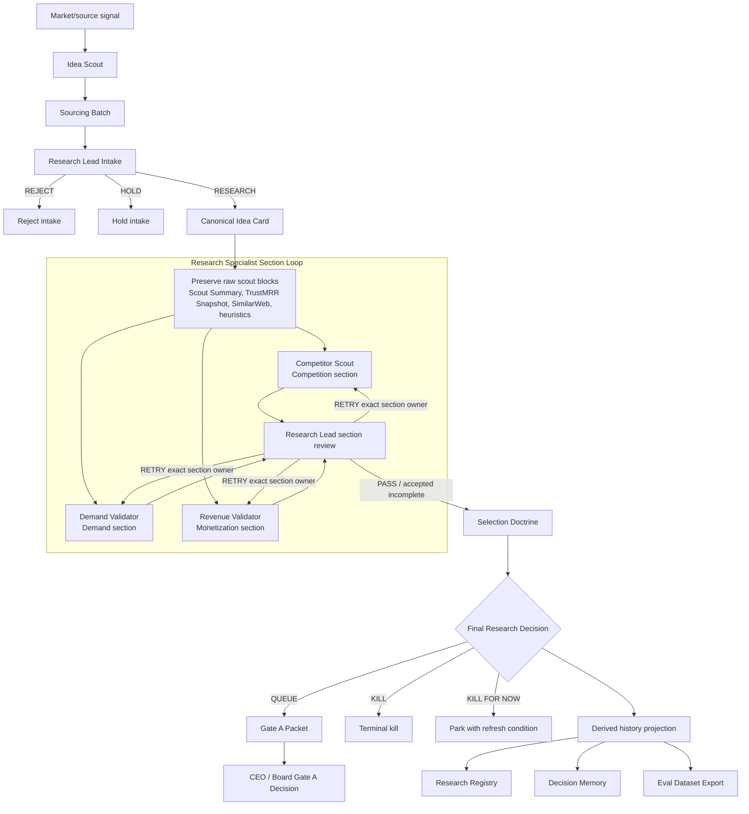

# Research Module

This is the canonical module passport for NoHum Research.

Research is the pre-Gate-A market-truth module. It turns revenue-visible raw
leads into decision-grade queue packages that can survive Gate A scrutiny.

Use [Module Documentation Standard](../atlas/module-documentation-standard.md)
for the passport format.

## Purpose

Research exists to decide whether a raw market/source signal is strong enough
to enter the queue for Product Bet Validation.

Its final output is a Gate A-ready package backed by one canonical `Idea Card`.
It does not define the post-Gate-A product. It does not approve build.

## Boundary

Research owns:

- market/source signal intake
- sourcing batches
- canonical `Idea Card` creation and section discipline
- competitor, demand, and revenue evidence before Gate A
- `Selection Doctrine`
- final research decision: `QUEUE`, `KILL`, or `KILL FOR NOW`
- Gate A packet preparation
- derived research history surfaces

Research must not:

- start Product Bet Validation before Gate A
- rewrite a Product Bet after Gate A
- create landing/waitlist/traffic/measurement artifacts
- approve Gate A or Gate B
- treat synthetic audience, generic web chatter, or unsupported inference as
  market proof
- create shadow histories outside the canonical `Idea Card`

## Activation

Research activates when:

```text
queue slot exists
-> CEO / Research Lead opens or continues research capacity
-> Idea Scout receives sourcing task
-> Research Lead selects candidates for intake
```

The root package may import research agents, skills, docs, and templates, but
active research runtime work starts only from manager-created tasks or explicit
bootstrap research tasks.

## Doctrine

```text
Idea Card owns market truth.
Gate A opens product definition, not build.
Research can recommend queue action.
Research cannot approve Gate A, Product Bet Validation, Gate B, or build.
```

Stage discipline:

- intake stage uses only `REJECT | HOLD | RESEARCH`
- final stage uses only `QUEUE | KILL | KILL FOR NOW`
- final-stage language must not appear before specialist sections and
  `Selection Doctrine` are complete enough for Research Lead review

The shared selection filter is the normalized `11-point` doctrine in
[Copyable Product Thesis](./copyable-product-thesis.md).

## Process Map



## Objects

| Object | Type | Owner | Source-of-truth rule |
|---|---|---|---|
| `market_source_signal` | input | Idea Scout | external source refs, not a decision |
| `sourcing_batch` | working artifact | Idea Scout | bounded batch, not intake approval |
| `research_case_id` | identity | Research Lead | assigned when canonical `Idea Card` opens |
| `idea_card` | canonical artifact | Research Lead | owns market truth before Gate A |
| `specialist_section` | card section | section owner | written inside or linked from the same `Idea Card` |
| `competitor_evidence_card` | support artifact | Competitor Scout | supports but does not replace the `Idea Card` |
| `traffic_validation_sheet` | support artifact | Demand Validator | supports but does not replace the `Idea Card` |
| `evidence_gap_log` | support artifact | specialist / Research Lead | records missing or blocked proof |
| `selection_doctrine` | decision synthesis | Research Lead | inside the `Idea Card` |
| `gate_a_packet` | approval packet | Research Lead | asks CEO/board to open Product Bet Validation |
| `research_registry` | derived memory | Research Lead | projection from canonical `Idea Card` |
| `decision_memory` | derived memory | Research Lead | duplicate/revisit projection, not new truth |
| `eval_dataset_export` | derived memory | Research Lead / eval consumers | append-only evaluation snapshot |

Invalid substitutes:

- separate specialist packets with no canonical `Idea Card`
- final verdict written before specialist review
- derived memory used to override the `Idea Card`
- Product Bet docs used as pre-Gate-A research proof

## States

Research state discipline is defined in
[ONT-04 Research State Machine](../ontology/nohum-operating-ontology.md).

| State | Owner | Required artifact | Allowed next decisions |
|---|---|---|---|
| `source_signal` | Idea Scout | raw signal | `source_batch` |
| `sourcing_batch_ready` | Idea Scout | sourcing batch | `select_for_intake`, `discard_batch` |
| `research_intake` | Research Lead | intake notes | `open_idea_card`, `reject_intake`, `hold_intake` |
| `idea_card_open` | Research Lead | canonical `Idea Card` | `assign_specialist_sections` |
| `specialist_sections_in_progress` | specialists | section updates | `submit_section` |
| `research_lead_review` | Research Lead | section submissions | `pass_section`, `retry_section`, `escalate_section` |
| `section_retry` | exact section owner | retry request | `resubmit_section` |
| `selection_doctrine_ready` | Research Lead | doctrine section | `queue`, `kill`, `kill_for_now` |
| `gate_a_packet_ready` | Research Lead | Gate A packet | `request_gate_a_decision` |
| `gate_a_review` | CEO / Board | approval request | `approve_gate_a`, `reject_gate_a`, `request_more_research` |

## Decisions

| Decision | From | To | Owner | Required evidence |
|---|---|---|---|---|
| `source_batch` | `source_signal` | `sourcing_batch_ready` | Idea Scout | source refs and batch scope |
| `select_for_intake` | `sourcing_batch_ready` | `research_intake` | Research Lead | shortlist rationale and duplicate check |
| `open_idea_card` | `research_intake` | `idea_card_open` | Research Lead | preserved raw data and `research_case_id` |
| `assign_specialist_sections` | `idea_card_open` | `specialist_sections_in_progress` | Research Lead | section owners and expected outputs |
| `retry_section` | `research_lead_review` | `section_retry` | Research Lead | exact weak section and missing evidence |
| `queue` | `selection_doctrine_ready` | `queued` | Research Lead | doctrine pass enough for Gate A packet |
| `kill` | `selection_doctrine_ready` | `killed` | Research Lead | terminal failure reason |
| `kill_for_now` | `selection_doctrine_ready` | `killed_for_now` | Research Lead | refresh condition |
| `request_gate_a_decision` | `gate_a_packet_ready` | `gate_a_review` | Research Lead | Gate A packet |
| `approve_gate_a` | `gate_a_review` | `gate_a_approved` | CEO / Board | Gate A packet and management approval |

Recommendation is not approval. `QUEUE` recommends Gate A review. It does not
open Product Bet Validation by itself.

## Agents

| Agent | Reports to | Owns | Writes | Cannot approve |
|---|---|---|---|---|
| `research-lead` | CEO | intake, canonical card, section review, final research verdict | `Idea Card`, section review, `Selection Doctrine`, Gate A packet, derived history projection | Gate A, Product Bet, Gate B, build |
| `idea-scout` | Research Lead | sourcing batches and rough first-pass screening | TrustMRR sourcing batch, duplicate notes, shortlist-ready rows | intake, final verdict, research case creation |
| `competitor-scout` | Research Lead | competitor discovery and category proof | Competition section, competitor evidence cards | final verdict, Gate A |
| `demand-validator` | Research Lead | demand-class proof and ambiguity control | Demand section, traffic validation, evidence gaps | pricing decision, queue promotion |
| `revenue-validator` | Research Lead | monetization reality and first-payment path | Monetization section, pricing/economics notes | payment acceptance, final verdict |

## Skills

Runtime base skills:

- `paperclip`
- `paperclip-knowledge`

Mandatory local skills:

- `venture-policy`
- `research-scorecard`
- `research-trustmrr-intake`
- `research-source-registry`
- `research-competitor-discovery`
- `research-competitor-analysis`
- `research-demand-validation`
- `research-traffic-validation`
- `research-revenue-validation`
- `research-evidence-fallbacks`
- `research-canonical-package`
- `competitor-analysis`
- `market-sizing`
- `pricing-strategy`
- `monetization-strategy`
- `identify-assumptions-new`
- `prioritize-assumptions`

Optional local skills:

- `user-personas`
- `sentiment-analysis`

Skill bundles are indexed in [Team Skill Matrix](../team-skill-matrix.md).

## Tools And MCP

For detailed access policy, use [MCP Access Matrix](../mcp-access-matrix.md).

| Tool/source | Main users | Secret/access | Allowed research use |
|---|---|---|---|
| Paperclip | all research agents | runtime auth | issues, assignments, comments, approvals |
| Paperclip Knowledge | all research agents | runtime auth | canonical and derived research artifacts |
| TrustMRR | Idea Scout | `TRUSTMRR_API_KEY` | sourcing batches |
| Apify SimilarWeb | Idea Scout, Competitor Scout, Demand Validator | `APIFY_TOKEN` | enrichment and source support when configured |
| Brave Search | Research Lead, Revenue Validator, optional specialists | `BRAVE_API_KEY` | bounded source discovery |
| OpenRouter-backed workflows | Competitor Scout when approved | `OPENROUTER_API_KEY` | competitor discovery support |
| Browser/web research | specialists | no secret or approved browser runtime | source collection and citation |

Access states must be explicit:

- `READY`
- `MISSING_ACCESS`
- `APPROVAL_REQUIRED`
- `BLOCKED_BY_POLICY`

Missing access is not a market signal.

## Memory

Canonical truth:

- `Idea Card`

Derived memory:

- `Research Registry`
- `Decision Memory`
- `Eval Dataset Export`

Rules:

- derived surfaces project from the canonical `Idea Card`
- derived surfaces may not introduce new business facts
- derived surfaces may not override final verdicts, timestamps, confidence, or
  reason codes
- if derived memory conflicts with the `Idea Card`, fix the `Idea Card` first
  and regenerate derived rows

Memory details are defined in [Research History Layer](./history-layer.md) and
[Paperclip Runtime Compatibility](./paperclip-runtime-compatibility.md).

## Outputs

Each selected research candidate should produce:

- one canonical `Idea Card`
- preserved raw scout blocks
- competition section
- demand section
- monetization section
- supporting evidence cards or gap logs when needed
- `Selection Doctrine`
- final decision: `QUEUE`, `KILL`, or `KILL FOR NOW`
- Gate A packet when final decision is `QUEUE`
- derived `Research Registry` update
- derived `Decision Memory` update
- derived `Eval Dataset Export` row

Done means the next owner can act from the artifact alone.

## Failure Modes

| Failure | Correct response |
|---|---|
| specialist writes separate notes but not the canonical card | return to exact section owner |
| final verdict appears before specialist review | remove/mark invalid and return to review state |
| `QUEUE` lacks doctrine evidence | retry `Selection Doctrine` |
| weak or stale evidence is treated as proof | add evidence gap or downgrade confidence |
| duplicate lead bypasses `Decision Memory` | return to Research Lead intake |
| Product Bet work starts before Gate A | `CONTRACT_CONFLICT`; reroute to CEO/Launch Lead |
| derived memory conflicts with `Idea Card` | canonical card wins; regenerate derived rows |
| source access missing | record `MISSING_ACCESS`, not weak market demand |

Incident rule:

- `consequence_fix`: repair the current research runtime object.
- `cause_fix`: update docs, agent instructions, skills, validators, runtime
  sync, or evals so the failure recurs less often.

## Source Map

| Need | Source |
|---|---|
| module standard | [Module Documentation Standard](../atlas/module-documentation-standard.md) |
| full factory module index | [Factory Module Map](../atlas/factory-module-map.md) |
| research ontology and states | [Operating Ontology](../ontology/nohum-operating-ontology.md) |
| execution sequence | [Research Execution System](./research-execution-system.md) |
| manager playbook | [Research Playbook](../playbooks/research-playbook.md) |
| selection doctrine | [Copyable Product Thesis](./copyable-product-thesis.md) |
| source ownership | [Source Registry](./source-registry.md) and [Source Adapter Registry](./source-adapter-registry.md) |
| duplicate/history layer | [Research History Layer](./history-layer.md) |
| runtime compatibility | [Paperclip Runtime Compatibility](./paperclip-runtime-compatibility.md) |
| fallback handling | [Evidence Fallback Matrix](./evidence-fallback-matrix.md) |
| traffic interpretation | [Traffic Interpretation Bands](./traffic-interpretation-bands.md) |
| intake/handoff contracts | [Contracts: Intake and Handoffs](./contracts/intake-and-handoffs.md) |
| adapter contracts | [Contracts: Shared Adapters](./contracts/shared-adapters.md) |
| tool and secret access | [MCP Access Matrix](../mcp-access-matrix.md) |
| skills by team | [Team Skill Matrix](../team-skill-matrix.md) |
| artifact templates | [Research Templates](../templates/research/) |

## Foundation Rule

Research Foundation v1 is complete only when these surfaces are frozen:

- intake schema
- domain enrichment schema
- adapter ownership
- retry/escalate semantics
- incident routing
- current-vs-target role split
- duplicate policy for TrustMRR-sourced leads
- research history surfaces and controlled reason-code taxonomy

These surfaces stay frozen so `Idea Scout` and the rest of the research lane can
evolve without reopening module-level architecture.
